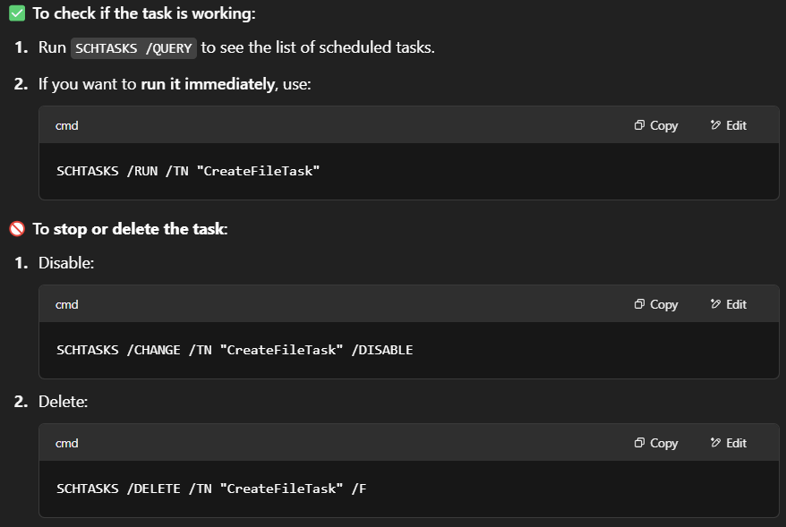
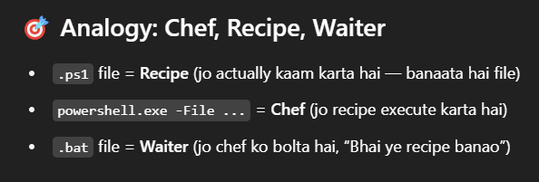
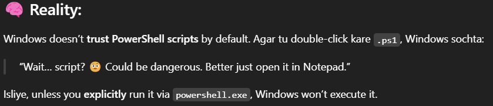

### ⚡1april
- Constrcutor in java
- change the  setting of code runner ,so that, the output will run on ternimal ,enabling us to give input as well . Soppose it will ask us to provide 2 numbers , and then give output based on our input.

-   

        
    
            Explore more about Static and Non Static keyword 
        
  

            ✨
            - 
    

- in april I plan to 
    - to walk daily for one hour
    - learn blender
    - learn C
    - learn Java

### ⚡2apr

- Ctel + D to select one by one similar value in vs code.

- forgot to write return 0; but still running,bcoz inbuilt in newer versions of C.

### ⚡3apr
- Java
   -  Object-oriented hai → Har cheez class aur object ke around ghoomti hai.

   -  Static vs Non-Static → Agar alag-alag objects ke liye alag data chahiye, to static mat use kar.

   -  this tabhi kaam karega jab object bana hoga, static ke andar this nahi chalega.

   - Constructor use kar, setInfo() ki zaroorat nahi padti.

### ⚡4apr

- use time command before each python main.py ; time gcc ./a.out , to find the time taken for execution;

- for using return cariage use `\r,end =" "` , the end ="" is important .

### ⚡5apr
- how to finf time taken in windows terminal , by a code to get executed.(in the same way we do in linux with time python main.py)
- calling a class inside a class in java.
- what if no internet and u try to push the code to github.
- 2 terminals chating.

### ⚡8apr
- `Alt+0176` ° for degree symbol
- sequence of if-else statement matters , refer FizzBuzz Program.
- working with git and gitignore
    - observe that git init command in terminal creates a .git folder (hidden),which confirms git has intialised here
    - now make a .gitignore file and inside mention the path and file format ,use wildcards.
---      
- Keep your repos clean with .gitignore.
- Use git add -f to include ignored files only when necessary.
- For bigger projects, structure .gitignore by language and file type.
---

- Noticed extra files (`.class`, `.out`) being pushed — these are **compiled files**, not needed in the repo.
- touch a gitignore file and add the paths or file extensions to be ignored.

        Pattern	Effect
        *.class	-->Ignores .class files only in the current folder
        **/*.class -->Ignores .class files in all folders and subfolders
---
-  Only if u want ,Remove Already Tracked Compiled Files

        git rm --cached *.class
        git rm --cached *.out
        git commit -m "Removed compiled files and added .gitignore"
        git push
---
- If Ignored Files Are Needed Later

        git add -f MyProgram.class
        git commit -m "Added MyProgram.class for debugging"
        git push

    To remove it again:

        git rm --cached MyProgram.class
        git commit -m "Removed .class file"
        git push
---

### ⚡9apr

- `!= `not equal to
- ` gcc number_compare.c -o nb;./nb`
-  for loop in python to print even number using modulus , i++and continue statement;  
- nested `if`s ,if statement placed inside another if or else block.
- inPython some code  

        import time
        print('test')

        try:
            def loopme(int):
                for i in range(int):
                    if(i%2==0):
                        print(f'{i} is Even.')                    
                    else:
                        print(i)

            # loopme(20)
            loopme('m')
                
        except:
            print("Something went wrong")
---

### ⚡apr10

- insert keyboard key in eclipse IDE. Cursor problem.

### ⚡apr14

- Measure-Command {} - in Windows  
  - `java HelloWorld; Measure-Command { java HelloWorld > $null }  `
  - ✅ Does redirecting to $null / Out-Null affect timing?  
     Short answer:    
    👉 Thoda sa, haan — lekin usually negligible
    Detailed answer below 👇      

        🔍 Why could it affect timing?
        When you run:

       
        Measure-Command { java HelloWorld }
        The Java process runs

        Its output is sent to the console

        Console I/O (writing to the screen) takes a small but real amount of time
        (especially if output is large or if the terminal is slow)

        When you do:

       
        Measure-Command { java HelloWorld | Out-Null }
        or       
        Measure-Command { java HelloWorld > $null }
        The Java process runs the same

        But its output is discarded immediately

        No time wasted printing to console
        (output stream gets redirected and discarded in memory)

        ➡️ This saves a tiny bit of time — typically milliseconds unless:

        The program prints a lot

        The console is slow

        Or the system is under heavy load

- Say your program takes 2.000 seconds to compute + 0.100 seconds to print 

    Measure-Command { java HelloWorld }
    → 2.100 sec

    Measure-Command { java HelloWorld | Out-Null }
    → 2.000 sec

    So — yes — output handling is part of the total execution time unless discarded.
 
  

### ⚡apr16

| Access Modifier | Same Class | Same Package | Subclass (Different Package) | Non-subclass (Different Package) |
|:----------------|:------------|:--------------|:-------------------------------|:-----------------------------------|
| `public`         | ✔️          | ✔️            | ✔️                             | ✔️                                 |
| `private`        | ✔️          | ❌            | ❌                             | ❌                                 |
| `protected`      | ✔️          | ✔️            | ✔️ (inheritance)               | ❌                                 |
| *default*        | ✔️          | ✔️            | ❌                             | ❌                                 |

### ⚡17apr

- gradients in photoShop 
    - `ctlr+j` copy
    - using filter , apply gaussian blur
    - using filter add noise 
    - `Ctrl+shift+A` camera raw
    - inpower point use gradient trancparency .
    

### ⚡18apr

- "Java" is not equal to "java" or "Java "    
 (extra spaces and capitalization matter because Java strings are case-sensitive).  
- can write int straight away `System.out.println(75);`
- "s", "9", "text" are examples of strings (represented by double quotes)  
- 's', '9', '+' are examples of characters (represented by single quotes) 
- A variable acts as a container for storing data that you can use and modify throughout your program.

### ⚡21apr
- while setting up virtual environments ,ran into these issues
- `Set-ExecutionPolicy -Scope Process -ExecutionPolicy RemoteSigned`

### ⚡23apr

- bash is simailar to a programming language?
- like linux cron job, in windows we have schedule task
- write allthe commands in a bat or ps1 file ,give it required permission
- execution policy for virtual environment
- `echo %DATE:~0,2%`
- `pip list | findstr "tk`
-  `pip show Flask`
- `conda list Flask`

### ⚡24apr
- windows task scheduler to automate git commit and git push commands
         
      📝
      - .ps1 file contains the script , whereas bat file executes that script file .   

      - fileRecipe.ps1  ,contains    

        $time= Get-Date -Format "yyyyMMdd_HHmmss"
        $t2 = Get-Date -Format "yyyy-MM-dd HH:mm:ss"

        $filepath= "X:\myCmdd\impText_$time.txt"

        "I was created at: $t2" |Out-File -FilePath $filepath   

      - runThis.bat  

        powershell.exe -ExecutionPolicy Bypass -File "X:m\myCmdd\fileRecipe.ps1"

---

    
All details... on this topic Click here

     
    ---
        ✅ Option 1: Run from PowerShell manually
        Open PowerShell (Win + S → search "PowerShell" → Run as Administrator)

        Type this and hit Enter:

        powershell
        Copy
        Edit
        powershell.exe -ExecutionPolicy Bypass -File "E:\mycmmd\createFile.ps1"
        ✅ Option 2: Run via .bat file (double-click method)
        Make a run.bat file with this line:

        bat
        Copy
        Edit
        powershell.exe -ExecutionPolicy Bypass -File "E:\mycmmd\createFile.ps1"
        Then just double-click the run.bat file.
    ---
        ✅ Step 1: Create PowerShell script
        Open Notepad

        Paste this inside:

        powershell
        
        $time = Get-Date -Format "yyyyMMdd_HHmmss"
        $filepath = "E:\mycmmd\impText$time.txt"
        "i was created at $time" | Out-File -FilePath $filepath
        Save it as:

        makefile
        
        E:\mycmmd\createFile.ps1
        ✅ Script ready.

        ✅ Step 2: Create .bat file to run this script
        Open Notepad

        Paste this inside:

        bat
        
        powershell.exe -ExecutionPolicy Bypass -File "E:\mycmmd\createFile.ps1"
        pause
        Save it as:

        makefile
        
        E:\mycmmd\runScript.bat
        Make sure to select "Save as type: All Files", not .txt.

        ✅ Double-click setup ready.

        ✅ Step 3: Run and Test
        Now just double-click runScript.bat

        Ek CMD window khulega, aur file create hogi like:

        
        impText20250424_1945.txt
        File ke andar:

       
        i was created at 20250424_1945

    ---
        🔍 Why this extra process is needed?
        By default:

        Windows doesn’t run .ps1 scripts on double-click

        It opens them in Notepad, or does nothing, because of security reasons

        That’s why we use .bat as a launcher
    ---

    

    

---

- Use Task Scheduler --> create task-->highest privlege-->trigger time

- cmd   

        🔧 Steps for CMD Automation:
        Open Command Prompt (CMD) as Administrator (right-click and "Run as Administrator")

        Run this command to create a task that runs your PowerShell script every 5 minutes:

        
        SCHTASKS /CREATE /SC MINUTE /MO 5 /TN "CreateFileTask" /TR "powershell.exe -ExecutionPolicy Bypass -File E:\mycmmd\createFile.ps1" /F   

        /SC MINUTE: Task runs every minute.

        /MO 5: Every 5 minutes.

        /TN "CreateFileTask": Task name.

        /TR: Specifies the program/command to run.

        /F: Forces the task to be created (overwrites if exists).

-  To disable this automation  
 

- Windows Task Scheduler minimum frequency is 1 minute — it doesn’t support every 30 seconds natively.

---

 
 
 

 ---

- ✅ To directly run a .ps1 file (without .bat), you need to do this:
Option 1: Run from PowerShell manually    
 - powershell.exe -ExecutionPolicy Bypass -File "E:\mycmmd\createFile.ps1"

- ✅ Safer & Better Option: .bat wrapper (just like you did)  

    The .bat file acts like a secure button:

    You control what it runs

    You can double-click it safely

    You can log, add pause, etc.

### ⚡apr26  
- in java     

      - int x,y,z =10,20,30;

      - int x,y,z;
        x=y=z=50;

- all java variables must have a unique name
- boolena isJavaFun = true -->correct         
  boolean isJavaFiun = 'true' -->incorrect

- double myDbl = 9.78d;  
  int myInt = (int) myDbl;  
  -->9

- 
