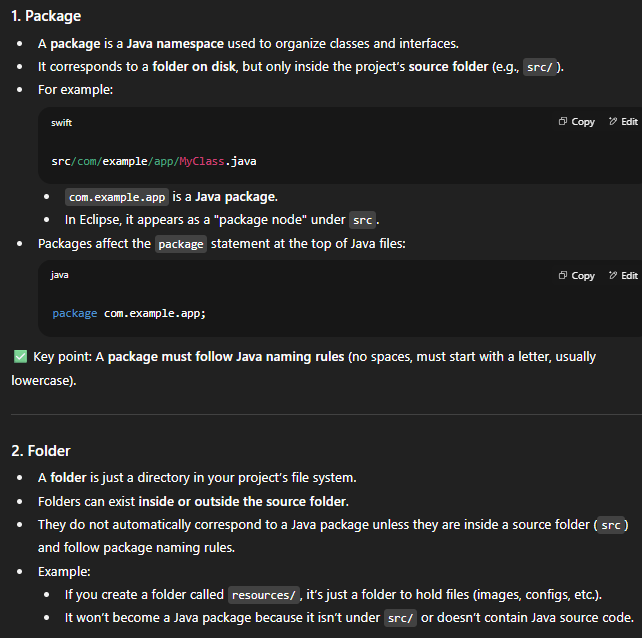

### ⚡aug1
1. brainstromed on few project/product ideas
2. guide for faster projecct execcution
3. challenging month java collection-->servlet-->small flask-->mern .
4. atleast one project .

### ⚡aug2

<details>

>Two seperate class with their own main() method inside, each having some variables inside the main method.
- would they able to use each others datamembers?? 
- `no`

⁉️- for questions that come to my 🧠

#### Java vs C Executable Files (Platform Independence)
- C code compiled on Windows creates a .exe file (Windows only).
- C code compiled on Linux creates a Linux binary (Linux only).
- These executables are not interchangeable between OSes.
- Java code compiles to bytecode (.class/.jar), not native OS executables.
- The same Java bytecode runs on any OS with a JVM (Windows, Linux, Mac, etc.).
- JVM makes Java platform independent; C executables are platform dependent.

---

🖥️ C Language (Platform Dependent)  
C code is compiled by a compiler into machine-specific executable code.  

The compiler converts the code into a .exe or binary based on the OS and architecture.  

📌 Example:  
- On Windows → winCode.exe
- On Linux → linCode (no .exe, just binary)  

✅ Each OS needs separate compilation.  
🚫 You cannot run Windows executable on Linux, or vice versa.  

☕ Java Language (Platform Independent at bytecode level)  
Java code is compiled by the Java Compiler (javac) into bytecode (.class file).  

This bytecode is not tied to any specific OS.  

It runs using the Java Virtual Machine (JVM) which acts as a bridge between OS and bytecode.  

📌 Example:  
MyProgram.java → Compiled to → MyProgram.class  

This .class file can run on:  

Windows JVM  

Linux JVM  

Mac JVM (or any other OS with JVM)  

✅ Write once, run anywhere (as long as JVM is installed)  
🚫 But .class is not a standalone executable like .exe; it needs JVM to run.  


</details>

---


### ⚡aug3

⁉️ 
- why do we even use local variable in java (inside method)?
- in java how does pointer work , what is commom between ref variable and object itself.?
- /n at end or start?
🟢 Best Practice    

|Use case|Recommended|
|---|---|
|Normal line output|Use \n at end only |
|Visually separate outputs|Use \n at start or both |
	  

### ⚡aug5
- `https://chatgpt.com/share/6892123f-240c-800d-910e-69baeff6f9ca`

### ⚡aug6

<details>

#### java Circle class...

```java

+--------------------------+
|      METHOD AREA         |  <-- Class-level memory (shared)
+--------------------------+
| Circle class loaded       |
| static float pi = 3.14    |
| static int[] myArr2       |
|   → reference → @0xA123   |  <-- (points to heap array)
| static method staticInfo4() |
+--------------------------+


+--------------------------+
|           HEAP           |  <-- Object-level memory
+--------------------------+
| Array @0xA123             |  <-- static myArr2 actual data
|   [1, 2, 5, 11]           |
+--------------------------+
| c1 → Circle object @0xB101|
|   radius = 1              |
|   color = null            |
|   myArr1 → @0xC001        |
+--------------------------+
| Array @0xC001             |  <-- non-static array of c1
|   [1, 3, 7]               |
+--------------------------+
| c2 → Circle object @0xB102|
|   radius = 3              |
|   color = null            |
|   myArr1 → @0xC002        |
+--------------------------+
| Array @0xC002             |  <-- non-static array of c2
|   [1, 3, 7]               |
+--------------------------+


+--------------------------+
|          STACK           |  <-- Method-local memory (per thread)
+--------------------------+
| main()                   |
|   Circle c1 → @0xB101     |
|   Circle c2 → @0xB102     |
+--------------------------+
| c1.perimeter1()          |
|   float res              |
+--------------------------+
| c1.surfaceArea2()        |
|   float res              |
+--------------------------+
| c1.volume3()             |
|   float res              |
+--------------------------+
| c2.perimeter1()          |
|   float res              |
+--------------------------+
| c2.surfaceArea2()        |
|   float res              |
+--------------------------+
| c2.volume3()             |
|   float res              |
+--------------------------+
| staticInfo4()            |
|   int x = 360            |  <-- local variable of static method
+--------------------------+

```
</details>

### ⚡aug7

>`Starting is the perfect condition.`

### ⚡aug11  
- Learing generics

### ⚡aug12
-shifting as well as studying...

### ⚡aug13
- Arrays in java
<details>

```java
int[] numbers = {1, 2, 3, 4, 5};  

//This line creates an array of integers named numbers and initializes it with the values 1, 2, 3, 4, and 5. The square brackets [] tell Java that numbers is an array.

public class ArrayDemo {
    public static void main(String[] args) {
        int[] numbers = {1,2,3,4,5};
        int index=0;
        for(int i:numbers){
            System.out.println("Element at index "+index+" is "+i);
            index++;
        }
    }
}

```
</details>

### ⚡aug14

<details>

### SDLC
>SDLC is the structured process followed to design, develop, test, and deliver high-quality software within time and budget.

It helps teams work in steps so that:

- Requirements are clear

- Bugs are caught early

- Project stays on track


| Step                        | Purpose                                                   | Key Output                                 |
| --------------------------- | --------------------------------------------------------- | ------------------------------------------ |
| 1. **Requirement Analysis** | Understand *what* the client wants                        | SRS (Software Requirement Specification)   |
| 2. **Planning**             | Decide *how* to do it, cost, timeline                     | Project Plan                               |
| 3. **Design**               | Create blueprint of software (UI, database, architecture) | HLD & LLD (High-Level & Low-Level Designs) |
| 4. **Development**          | Write the actual code                                     | Source Code                                |
| 5. **Testing**              | Find and fix bugs                                         | Test Report                                |
| 6. **Deployment**           | Release software to production                            | Live System                                |
| 7. **Maintenance**          | Keep software running, update, fix                        | Patches, Updates                           |


</details>

### ⚡aug15

<details>

| Model                                      | Kaise Kaam Karta Hai                                               | Best For                                       | Cons                               |
| ------------------------------------------ | ------------------------------------------------------------------ | ---------------------------------------------- | ---------------------------------- |
| **1. Waterfall**                           | Steps strictly **one after another** (no going back)               | Simple, small projects with fixed requirements | No flexibility; changes are costly |
| **2. V-Model (Validation & Verification)** | Waterfall ka hi version, but har dev step ke saath testing planned | Projects needing strong QA                     | Still rigid                        |
| **3. Incremental Model**                   | Software deliver in **small working parts**                        | Medium projects, partial delivery possible     | Needs good planning                |
| **4. Iterative Model**                     | Build a basic version → improve in **repeated cycles**             | When requirements are not fully known          | Risk of rework                     |
| **5. Spiral Model**                        | Focus on **risk analysis** + repeated cycles                       | Large, high-risk projects                      | Expensive, complex                 |
| **6. Agile**                               | Break into **small sprints** (1–4 weeks), continuous feedback      | Projects with changing requirements            | Needs close client involvement     |
| **7. Big Bang**                            | No formal plan, start coding immediately                           | Very small, experimental projects              | High risk of failure               |

</details>


### ⚡aug18

<details>
array vs arrayList

</details>

### ⚡aug22
<details>

```java
public class Circle {   
    
    int radius;
    String color;
    
    static float pi = 3.142f;

    
    Circle(int radius) {
        this.radius = radius;
    }
    Circle(int radius,String color){
        this.radius = radius;
        this.color = color;
      }

    

    void perimeter1() {
        float res = 2 * this.radius * Circle.pi;

        System.out.printf("Circumference for the given radius is :- %.2f %n", res);
    }

    void surfaceArea2() {
        float res = 4 * pi * radius * this.radius;
        System.out.printf("Total surface Area for the given radius is :- %.2f %n", res);
    }

    void volume3() {
        float res = pi * radius * radius * radius * 4 / 3;
        System.out.printf("Volume for the given radius is :- %.2f%n", res);
    }
   
    static void staticInfo4() {
        int x = 360;
        System.out.printf("A cicrcle has %d degree's in it. %n", x);
    }

    int[] myArr1 = { 1, 3, 7 };
    static int[] myArr2 = { 1, 2, 5, 11 };
    
     
    //👇 see how I am making a static object of the class itself
    static Circle c3 = new Circle(9,"blue");


   public static void main(String[] args) {
      
      
        Circle.staticInfo4();
        System.out.println(Circle.pi);

        Circle c1 = new Circle(1);
        
        System.out.println(c1);
        c1.perimeter1();
        c1.volume3();
        c1.surfaceArea2();
        
        Circle c2 = new Circle(3);
        
        c2.volume3();
        c2.perimeter1();
        c2.surfaceArea2();
       
        c3.perimeter1();
        System.out.println(c1.myArr1[1]);

        System.out.println(Circle.myArr2[2]);

      
      
   }
}
```
</details>

⚡aug23

