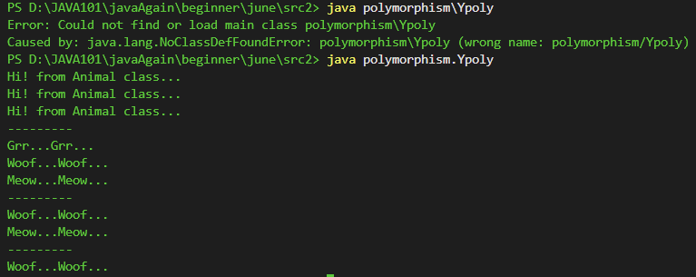
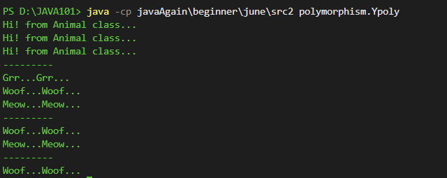

### ‚ö°aug1
1. brainstromed on few project/product ideas
2. guide for faster projecct execcution
3. challenging month java collection-->servlet-->small flask-->mern .
4. atleast one project .

### ‚ö°aug2

<details>

>Two seperate class with their own main() method inside, each having some variables inside the main method.
- would they able to use each others datamembers?? 
- `no`

⁉️- for questions that come to my 🧠

#### Java vs C Executable Files (Platform Independence)
- C code compiled on Windows creates a .exe file (Windows only).
- C code compiled on Linux creates a Linux binary (Linux only).
- These executables are not interchangeable between OSes.
- Java code compiles to bytecode (.class/.jar), not native OS executables.
- The same Java bytecode runs on any OS with a JVM (Windows, Linux, Mac, etc.).
- JVM makes Java platform independent; C executables are platform dependent.

---

🖥️ C Language (Platform Dependent)  
C code is compiled by a compiler into machine-specific executable code.  

The compiler converts the code into a .exe or binary based on the OS and architecture.  

üìå Example:  
- On Windows ‚Üí winCode.exe
- On Linux ‚Üí linCode (no .exe, just binary)  

‚úÖ Each OS needs separate compilation.  
üö´ You cannot run Windows executable on Linux, or vice versa.  

‚òï Java Language (Platform Independent at bytecode level)  
Java code is compiled by the Java Compiler (javac) into bytecode (.class file).  

This bytecode is not tied to any specific OS.  

It runs using the Java Virtual Machine (JVM) which acts as a bridge between OS and bytecode.  

üìå Example:  
MyProgram.java ‚Üí Compiled to ‚Üí MyProgram.class  

This .class file can run on:  

Windows JVM  

Linux JVM  

Mac JVM (or any other OS with JVM)  

‚úÖ Write once, run anywhere (as long as JVM is installed)  
üö´ But .class is not a standalone executable like .exe; it needs JVM to run.  


</details>

---


### ‚ö°aug3

⁉️ 
- why do we even use local variable in java (inside method)?
- in java how does pointer work , what is commom between ref variable and object itself.?
- /n at end or start?
🟢 Best Practice    

|Use case|Recommended|
|---|---|
|Normal line output|Use \n at end only |
|Visually separate outputs|Use \n at start or both |
	  

### ‚ö°aug5
- `https://chatgpt.com/share/6892123f-240c-800d-910e-69baeff6f9ca`

### ‚ö°aug6

<details>

#### java Circle class...

```java

+--------------------------+
|      METHOD AREA         |  <-- Class-level memory (shared)
+--------------------------+
| Circle class loaded       |
| static float pi = 3.14    |
| static int[] myArr2       |
|   ‚Üí reference ‚Üí @0xA123   |  <-- (points to heap array)
| static method staticInfo4() |
+--------------------------+


+--------------------------+
|           HEAP           |  <-- Object-level memory
+--------------------------+
| Array @0xA123             |  <-- static myArr2 actual data
|   [1, 2, 5, 11]           |
+--------------------------+
| c1 ‚Üí Circle object @0xB101|
|   radius = 1              |
|   color = null            |
|   myArr1 ‚Üí @0xC001        |
+--------------------------+
| Array @0xC001             |  <-- non-static array of c1
|   [1, 3, 7]               |
+--------------------------+
| c2 ‚Üí Circle object @0xB102|
|   radius = 3              |
|   color = null            |
|   myArr1 ‚Üí @0xC002        |
+--------------------------+
| Array @0xC002             |  <-- non-static array of c2
|   [1, 3, 7]               |
+--------------------------+


+--------------------------+
|          STACK           |  <-- Method-local memory (per thread)
+--------------------------+
| main()                   |
|   Circle c1 ‚Üí @0xB101     |
|   Circle c2 ‚Üí @0xB102     |
+--------------------------+
| c1.perimeter1()          |
|   float res              |
+--------------------------+
| c1.surfaceArea2()        |
|   float res              |
+--------------------------+
| c1.volume3()             |
|   float res              |
+--------------------------+
| c2.perimeter1()          |
|   float res              |
+--------------------------+
| c2.surfaceArea2()        |
|   float res              |
+--------------------------+
| c2.volume3()             |
|   float res              |
+--------------------------+
| staticInfo4()            |
|   int x = 360            |  <-- local variable of static method
+--------------------------+

```
</details>

### ‚ö°aug7

>`Starting is the perfect condition.`

### ‚ö°aug11  
- Learing generics

### ‚ö°aug12
-shifting as well as studying...

### ‚ö°aug13
- Arrays in java
<details>

```java
int[] numbers = {1, 2, 3, 4, 5};  

//This line creates an array of integers named numbers and initializes it with the values 1, 2, 3, 4, and 5. The square brackets [] tell Java that numbers is an array.

public class ArrayDemo {
    public static void main(String[] args) {
        int[] numbers = {1,2,3,4,5};
        int index=0;
        for(int i:numbers){
            System.out.println("Element at index "+index+" is "+i);
            index++;
        }
    }
}

```
</details>

### ‚ö°aug14

<details>

### SDLC
>SDLC is the structured process followed to design, develop, test, and deliver high-quality software within time and budget.

It helps teams work in steps so that:

- Requirements are clear

- Bugs are caught early

- Project stays on track


| Step                        | Purpose                                                   | Key Output                                 |
| --------------------------- | --------------------------------------------------------- | ------------------------------------------ |
| 1. **Requirement Analysis** | Understand *what* the client wants                        | SRS (Software Requirement Specification)   |
| 2. **Planning**             | Decide *how* to do it, cost, timeline                     | Project Plan                               |
| 3. **Design**               | Create blueprint of software (UI, database, architecture) | HLD & LLD (High-Level & Low-Level Designs) |
| 4. **Development**          | Write the actual code                                     | Source Code                                |
| 5. **Testing**              | Find and fix bugs                                         | Test Report                                |
| 6. **Deployment**           | Release software to production                            | Live System                                |
| 7. **Maintenance**          | Keep software running, update, fix                        | Patches, Updates                           |


</details>

### ‚ö°aug15

<details>

| Model                                      | Kaise Kaam Karta Hai                                               | Best For                                       | Cons                               |
| ------------------------------------------ | ------------------------------------------------------------------ | ---------------------------------------------- | ---------------------------------- |
| **1. Waterfall**                           | Steps strictly **one after another** (no going back)               | Simple, small projects with fixed requirements | No flexibility; changes are costly |
| **2. V-Model (Validation & Verification)** | Waterfall ka hi version, but har dev step ke saath testing planned | Projects needing strong QA                     | Still rigid                        |
| **3. Incremental Model**                   | Software deliver in **small working parts**                        | Medium projects, partial delivery possible     | Needs good planning                |
| **4. Iterative Model**                     | Build a basic version ‚Üí improve in **repeated cycles**             | When requirements are not fully known          | Risk of rework                     |
| **5. Spiral Model**                        | Focus on **risk analysis** + repeated cycles                       | Large, high-risk projects                      | Expensive, complex                 |
| **6. Agile**                               | Break into **small sprints** (1–4 weeks), continuous feedback      | Projects with changing requirements            | Needs close client involvement     |
| **7. Big Bang**                            | No formal plan, start coding immediately                           | Very small, experimental projects              | High risk of failure               |

</details>


### ‚ö°aug18

<details>
array vs arrayList

</details>

### ‚ö°aug22
<details>

```java
public class Circle {   
    
    int radius;
    String color;
    
    static float pi = 3.142f;

    
    Circle(int radius) {
        this.radius = radius;
    }
    Circle(int radius,String color){
        this.radius = radius;
        this.color = color;
      }

    

    void perimeter1() {
        float res = 2 * this.radius * Circle.pi;

        System.out.printf("Circumference for the given radius is :- %.2f %n", res);
    }

    void surfaceArea2() {
        float res = 4 * pi * radius * this.radius;
        System.out.printf("Total surface Area for the given radius is :- %.2f %n", res);
    }

    void volume3() {
        float res = pi * radius * radius * radius * 4 / 3;
        System.out.printf("Volume for the given radius is :- %.2f%n", res);
    }
   
    static void staticInfo4() {
        int x = 360;
        System.out.printf("A cicrcle has %d degree's in it. %n", x);
    }

    int[] myArr1 = { 1, 3, 7 };
    static int[] myArr2 = { 1, 2, 5, 11 };
    
     
    //üëá see how I am making a static object of the class itself
    static Circle c3 = new Circle(9,"blue");


   public static void main(String[] args) {
      
      
        Circle.staticInfo4();
        System.out.println(Circle.pi);

        Circle c1 = new Circle(1);
        
        System.out.println(c1);
        c1.perimeter1();
        c1.volume3();
        c1.surfaceArea2();
        
        Circle c2 = new Circle(3);
        
        c2.volume3();
        c2.perimeter1();
        c2.surfaceArea2();
       
        c3.perimeter1();
        System.out.println(c1.myArr1[1]);

        System.out.println(Circle.myArr2[2]);

      
      
   }
}
```
</details>

### ‚ö°aug23


- ⁉️agr main method khali ho pr class mei bhaut sari errors , tb bhi code error nahi deta ??

- FFmpeg

### ‚ö°aug24

‚ö° Java Rule:

Method overloading tab hoti hai jab parameter list different ho (type ya number me).

Yaha dono ppr ka parameter exactly same hai:

String... str ‚Üí varargs internally treat hota hai as String[] str.

Isliye compiler confuse hota hai ‚Üí bolta hai "duplicate method".


### ‚ö°aug26
 
- For giving conditions,
    - Concept of Exclusion and Inclusion.

### ‚ö°aug31

<details>

Ayush-Dube: terminal se ye java code kyu nahi chal rha 

VS Code: Aapka Java code terminal se run nahi ho raha ho sakta hai ki aapko sahi classpath ya package structure ka dhyan nahi diya gaya ho. Java me jab aap package ka use karte hain, toh aapko compile aur run karte waqt package path ka dhyan rakhna padta hai.

Ypoly.java file ka package hai `polymorphism`. Isliye aapko ye steps follow karne honge:

1. Terminal me us folder par jayein jahan `polymorphism` folder hai (yani `src2` ke andar).
2. Compile karne ke liye:
   
```
   javac polymorphism/Ypoly.java
   ```
3. Run karne ke liye:
   
```
   java polymorphism.Ypoly
   ```
Agar aap kisi aur directory me hain toh classpath specify karna padega:
```
java -cp . polymorphism.Ypoly
```

Agar ab bhi problem aaye toh ensure karein ki aapka folder structure sahi hai aur file ka naam aur package declaration match karte hain.

Aap terminal me directly run karne ke liye **Terminal: Create New Terminal** command ka use kar sakte hain.


Show in Command Palette

Ayush-Dube: jb meiny package polymorphism line comment kari tb ye code chal terminal mei but aab eclipse mei nahi chalyga kyu 

GitHub Copilot: Jab aap `package polymorphism;` line ko comment kar dete hain, toh Java file kisi package ka hissa nahi rehti. Is wajah se:

- **Terminal me:** Agar aap terminal me `src2/polymorphism` folder ke andar hain aur `javac Ypoly.java` run karte hain, toh bina package ke code compile/run ho jata hai.
- **Eclipse me:** Eclipse project structure packages ke hisaab se hota hai. Agar aapki file `polymorphism` folder ke andar hai, toh usme `package polymorphism;` hona chahiye. Agar nahi hai, toh Eclipse error dega: "The declared package does not match the expected package".

**Summary:**  
- **Terminal:** File ka package declaration aur folder structure match hona chahiye, warna bina package ke file root folder me honi chahiye.
- **Eclipse:** File ka package declaration aur uska folder structure match hona zaroori hai.

**Sahi tarika:**  
Agar file Ypoly.java me hai, toh `package polymorphism;` likhna chahiye.  
Agar bina package ke likhna hai, toh file ko `src2` ya kisi root folder me rakhein.

**Eclipse me chalane ke liye:**  
- `package polymorphism;` line uncomment karein.
- File ko `polymorphism` folder ke andar hi rakhein.

Aapko folder structure aur package declaration ko hamesha sync rakhna chahiye.

Ayush-Dube: [Running] cd "d:\JAVA101\javaAgain\beginner\june\src2\polymorphism\" && javac Ypoly.java && java Ypoly
Error: Could not find or load main class Ypoly
Caused by: java.lang.NoClassDefFoundError: Ypoly (wrong name: polymorphism/Ypoly)

[Done] exited with code=1 in 0.584 seconds

y?

GitHub Copilot: Aapko ye error isliye mil rahi hai kyunki aapki class `Ypoly` package `polymorphism` ke andar hai, lekin aap `java Ypoly` likh kar run kar rahe hain. Java ko fully qualified class name chahiye hota hai jab package use hota hai.

**Sahi tarika:**

Terminal me `src2` folder ke andar jaakar ye command run karein:

```
java polymorphism.Ypoly
```

Aapka command kuch aisa hona chahiye:
```
cd d:\JAVA101\javaAgain\beginner\june\src2
javac polymorphism\Ypoly.java
java polymorphism.Ypoly
```

**Note:**  
- Jab bhi package use karte hain, run karte waqt package ka naam zaroor dena hota hai.
- Agar aap `java Ypoly` likhenge toh Java root package me `Ypoly` dhundhega, lekin aapki class `polymorphism` package me hai.

**Summary:**  
`java polymorphism.Ypoly` likhen, tabhi code chalega.

---
---
Aapka code sahi hai, lekin aap Java class ko galat tarike se run kar rahe hain.  
**Java me class run karte waqt:**
- **Backslash (`\`) nahi, dot (`.`) ka use karein.**
- **`.class` extension nahi lagana hai.**

**Sahi command:**

```sh
java polymorphism.Ypoly
```

**Aapka folder structure:**
```
src2/
  └── polymorphism/
        └── Ypoly.java
```

**Steps:**

1. Pehle compile karein:
   ```
   javac polymorphism\Ypoly.java
   ```
2. Fir run karein:
   ```
   java polymorphism.Ypoly
   ```

**Galat commands:**
- `java polymorphism\Ypoly` ‚ùå
- `java polymorphism\Ypoly.class` ‚ùå

**Sahi command:**
- `java polymorphism.Ypoly` ‚úÖ

**Note:**  
Aapko `src2` folder ke andar hi ye command chalani hai, jaise aap kar rahe hain.

Agar ab bhi error aaye, to ensure karein ki `Ypoly.class` file `polymorphism` folder ke andar bani ho.  
Aap `dir polymorphism` command se check kar sakte hain.


</details>

>You dont have to go inside the pacakge to run the java code,  
 remain in the source folder and just add packageName.ClassName.java

 
 ---
 

 