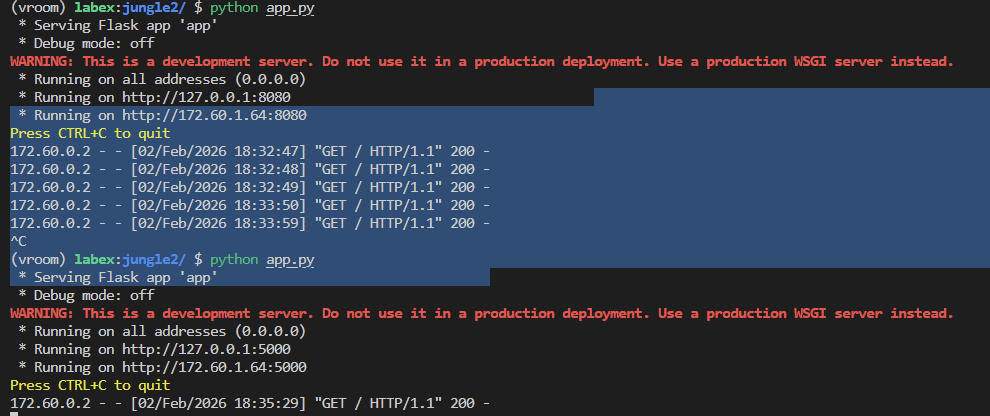
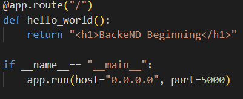

## ⚡feb1
**Statring backend with Flask**

## feb2

## ⚡feb11

HTTP - hyper text transfer protocol 

first TCP is established then the communication is done with HTTP

http - 80
https - 443

## ⚡feb12

jinja
server template engine {{}}
`Browser → Flask → Jinja → Final HTML → Browser`