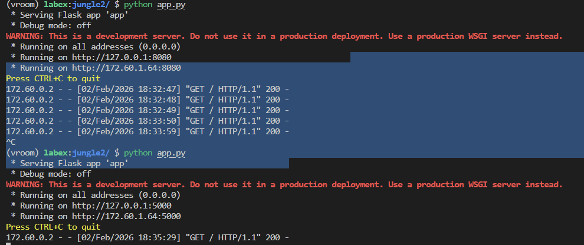
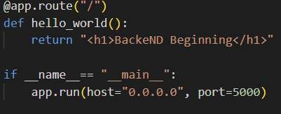
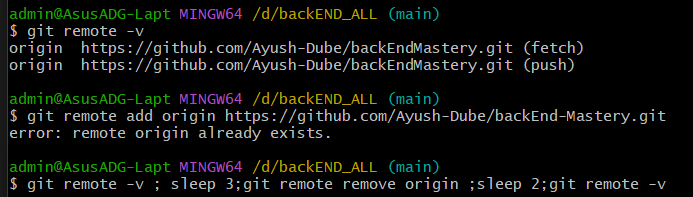

## ⚡feb1
**Statring backend with Flask**

## feb2






## ⚡feb11

HTTP - hyper text transfer protocol 

first TCP is established then the communication is done with HTTP

http - 80
https - 443


## ⚡feb12

jinja
server template engine {{}}
`Browser → Flask → Jinja → Final HTML → Browser`

## ⚡feb 14

git remote remove origin
git remote add origin https://github.com/yourusername/new-repo.git




```powershell
(.venv) 
admin@AsusADG-Lapt MINGW64 /d/backEND_ALL/using_Python/project_101a (main)
$ deactivate

admin@AsusADG-Lapt MINGW64 /d/backEND_ALL/using_Python/project_101a (main)
$ cd .. 

admin@AsusADG-Lapt MINGW64 /d/backEND_ALL/using_Python (main)
$ cd project_102/

admin@AsusADG-Lapt MINGW64 /d/backEND_ALL/using_Python/project_102 (main)
$ ls

admin@AsusADG-Lapt MINGW64 /d/backEND_ALL/using_Python/project_102 (main)
$ ll -a
total 0
drwxr-xr-x 1 admin 197121 0 Feb 14 16:22 ./
drwxr-xr-x 1 admin 197121 0 Feb 14 16:22 ../

admin@AsusADG-Lapt MINGW64 /d/backEND_ALL/using_Python/project_102 (main)
$ python -m venv venv

admin@AsusADG-Lapt MINGW64 /d/backEND_ALL/using_Python/project_102 (main)
$ source venv/Scripts/activate
(venv)
admin@AsusADG-Lapt MINGW64 /d/backEND_ALL/using_Python/project_102 (main)
$ pip list
Package    Version
---------- -------
pip        22.3.1
setuptools 65.5.0

[notice] A new release of pip available: 22.3.1 -> 26.0.1
[notice] To update, run: python.exe -m pip install --upgrade pip
(venv)
admin@AsusADG-Lapt MINGW64 /d/backEND_ALL/using_Python/project_102 (main)
$
```


PowerShell me check karo:

```cmd
attrib .git
attrib .prakaENV
```

### 🔧 Agar manually hidden banana ho
```cmd
attrib +h .prakaENV
```

```
Git reads .gitignore top to bottom
Last matching rule wins
Negation (!) re-includes
But parent must not be ignored
```


## ⚡feb16
```python
def test():
    print("A")
    return 5
    print("B")

print(test())
```
return 5 immediately exits the function, returning 5 to the caller.


```

================ PYTHON FUNCTION & DECORATOR CORE CRUX ================

1) VARIABLES = REFERENCES
--------------------------------------------------
a1 = "gold"
b1 = 123

Variables do NOT store values.
They store references to objects in memory.

a1 ---> "gold"
b1 ---> 123


2) FUNCTION IS ALSO AN OBJECT
--------------------------------------------------
def someFun():
    return "silver"

someFun ---> function object

Function is NOT special syntax.
It is an object stored in memory.


3) FUNCTION OBJECT vs FUNCTION CALL
--------------------------------------------------
someFun      -> function object
someFun()    -> executes function

print(someFun)     -> <function someFun at 0x...>
print(someFun())   -> silver

() means EXECUTE.


4) ASSIGNING FUNCTION TO ANOTHER VARIABLE
--------------------------------------------------
x = someFun

someFun ----|
            |----> function object
x       ----|

No new function created.
Only new reference created.

x() works because x points to same function.


5) DECORATOR CORE IDEA
--------------------------------------------------
Decorator:
1) Takes a function
2) Creates wrapper function
3) Returns wrapper
4) Replaces original reference


6) BASIC DECORATOR STRUCTURE
--------------------------------------------------
def operator(func):

    def wrapper(a,b):
        res = func(a,b)
        return f"Result is {res}"

    return wrapper


7) WHAT THIS LINE REALLY DOES
--------------------------------------------------
newAdd = operator(add)

STEP 1: operator(add) runs
        func ---> original add
        wrapper created
        return wrapper

STEP 2: assignment
        newAdd ---> wrapper
        add    ---> original add


8) WRAPPER STORES ORIGINAL FUNCTION (CLOSURE)
--------------------------------------------------
wrapper remembers:
    func ---> original add

This remembering is called CLOSURE.

Closure = function remembering outer variables
even after outer function ends.


9) TWO PHASES (VERY IMPORTANT)
--------------------------------------------------

PHASE 1: WRAPPING
newAdd = operator(add)
(No numbers passed here)

PHASE 2: EXECUTION
newAdd(2,5)

Flow:
newAdd(2,5)
    ↓
wrapper(2,5)
    ↓
func(2,5)
    ↓
add(2,5)
    ↓
5
    ↓
"Result is 5"


10) CRITICAL DIFFERENCE
--------------------------------------------------
return wrapper     -> returns function object
return wrapper()   -> executes wrapper immediately

Decorator MUST return function object.


11) REAL DECORATOR SYNTAX
--------------------------------------------------
@operator
def add(a,b):
    return a+b

Python internally does:
add = operator(add)


12) FINAL CORE LOCK
--------------------------------------------------
- Functions are objects.
- Variables store references.
- Decorator returns a new function object.
- Original reference gets replaced.
- Wrapper remembers original via closure.
- Execution happens only when called.

Decorator = reference replacement + closure.


================ END OF CORE FOUNDATION =================
```

## ⚡feb18

```
================= BACKEND FUNDAMENTALS =================

1) INTERNET COMMUNICATION LAYERS

User types: http://google.com

Flow:

[Browser]
    ↓
(DNS) → Domain → IP Address
    ↓
(TCP) → Connection establish (3-way handshake)
    ↓
(HTTP) → Structured Request sent
    ↓
[Server]
    ↓
HTTP Response
    ↓
Render in Browser


-------------------------------------------------------------

2) ROLE OF EACH COMPONENT

DNS  = Finds IP address (contact book)
IP   = Address system
TCP  = Reliable connection (pipe)
HTTP = Rules/format of communication
HTML = Document format (content)

Analogy:

HTML = Letter content
HTTP = Courier format
TCP  = Road / Phone call
IP   = House address
DNS  = Contact book


-------------------------------------------------------------

3) RAW TCP vs HTTP

Raw TCP:
- Just bytes
- No structure
- Hard to understand

HTTP:
- Structured text
- Standard format
- Easy to parse
- Used in web & APIs


-------------------------------------------------------------

4) HTTP REQUEST STRUCTURE

Example:

GET /login HTTP/1.1
Host: example.com
User-Agent: Chrome

Structure:

1. Request Line
   → METHOD + PATH + VERSION

2. Headers
   → Metadata (Host, Content-Type, etc.)

3. Blank Line
   → Separates headers from body

4. Body (optional)
   → Mostly used in POST/PUT


-------------------------------------------------------------

5) TCP CONNECTION BEHAVIOR

Old (HTTP/1.0):
- 1 request → 1 response → TCP close

Modern (HTTP/1.1 default):
- Keep-Alive
- Multiple request/response on same TCP connection
- Better performance


-------------------------------------------------------------

6) HTTP METHODS (Intent of Request)

GET     → Read data
POST    → Create data
PUT     → Replace/update data
DELETE  → Remove data

Same URL + Different Method = Different action


-------------------------------------------------------------

7) VERY IMPORTANT MENTAL MODEL

Browser does NOT send objects.
Browser sends TEXT over TCP.

Server parses text → builds objects.

Flask:
- Receives HTTP request
- Converts to request object
- Runs Python function
- Returns HTTP response

Flask does NOT handle DNS or TCP.
Lower layers handle that.


=============================================================
```

## ⚡feb19

🔥 WHY HTTP Request Structure Matters

As backend developer:

You are not “building websites”.

You are:

Receiving structured text over network  
Parsing it  
Running logic  
Sending structured text back    

🧱 HTTP Request Structure (Basic Form)  

```
GET /login HTTP/1.1
Host: example.com
User-Agent: Chrome
Accept: text/html
```

1️⃣ Request Line    

```
GET /login HTTP/1.1     
```         

| Part     | Meaning |
| -------- | ------- |
| GET      | Method  |
| /login   | Path    |
| HTTP/1.1 | Version |
 
2️⃣ Headers    
```
Host: example.com
User-Agent: Chrome
Accept: text/html
```


Think like:

Envelope ke upar instructions.

Example:

- Host → kaunse server ke liye

- User-Agent → kaun browser hai

- Content-Type → kya data bheja gaya

3️⃣ Blank Line

Very important.

Blank line tells:

>“Headers khatam. Body start.”


4️⃣ Body (Optional)

> GET request mein usually body nahi hoti.  

POST request mein body hoti hai.̥

for example:
 
```
POST /login HTTP/1.1
Host: example.com
Content-Type: application/json

{
  "username": "prakash",
  "password": "123"
}
```

<details>
<summary>Request - Response diff</summary>

When the server sends data back to the client, it does so as part of the HTTP response. However, the server's response is not characterized by methods like GET, POST, or DELETE. These HTTP methods are specific to requests made by the client to the server.

The server's response is characterized by:

HTTP Status Codes: These indicate the result of the client's request. For example:

200 OK: The request was successful, and the server is sending the requested data.
404 Not Found: The requested resource could not be found.
500 Internal Server Error: The server encountered an error.
Response Headers: These provide metadata about the response, such as content type, content length, caching policies, etc.

Response Body: This contains the actual data being sent back to the client (e.g., HTML, JSON, XML, or binary data).

In summary, the server doesn't use methods like GET or POST when sending data back. Instead, it sends an HTTP response with a status code, headers, and optionally a body, depending on the client's request and the server's logic.


</details>


## ⚡feb20

HTTP methods only part of REQUEST.
Response mei status code use hoty hain.

so  when u receive requests , as per methods you design you api for different functions .


```
Flask tumhe clean Python interface deta hai.

But underneath:

```
>### It’s just formatted text over TCP.

🎯 Beginner Confusion Point

Many beginners think:  

Browser sends “object” to server

No.

Browser sends TEXT.

Server converts it into objects.

Important mental model.


## ⚡feb21

🧠 Question:  

How does the server know where to send what? 


🖥️ What Happens Internally (Important for backend dev)

When request comes:

OS receives packet

OS checks port

Gives data to Flask process

Flask reads:

Method (GET/POST)

Path (/login)

Headers

Body

Flask matches route

Calls function

Function returns response

Flask converts it to HTTP response

OS sends it back 

```
Client
   ↓
Internet
   ↓
Server IP
   ↓
Port 5000
   ↓
Flask App
   ↓
Route Match
   ↓
Function Call
   ↓
Response
   ↓
Client
```