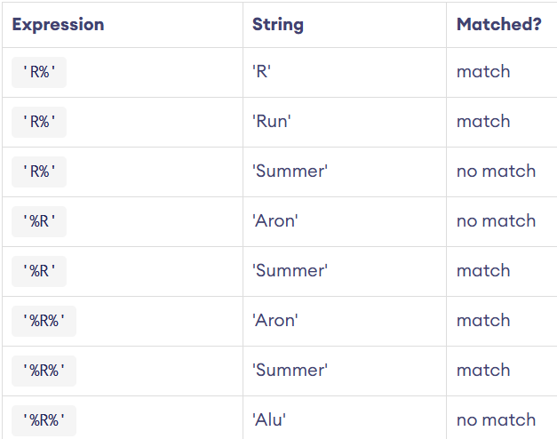

### ⚡jan1

### ⚡jan25
A wildcard is a special character used with the LIKE operator to match patterns in text data.

    

- Wildcard characters can have different meanings in different database systems. Therefore, we recommend you read the documentation on wildcards before using them.

### ⚡jan30

We learned how to:
- Check and manage MySQL service status  
- Access the MySQL shell
- View system databases
- Explore tables within system databases
- Query data from system tables