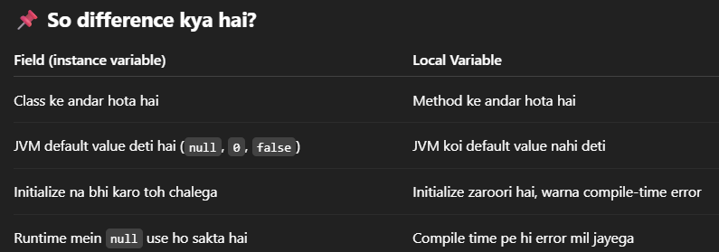
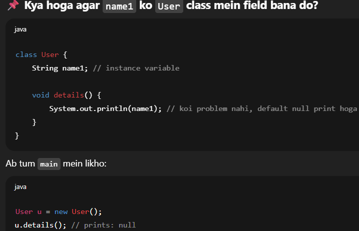
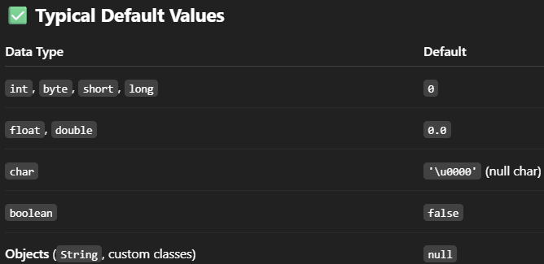
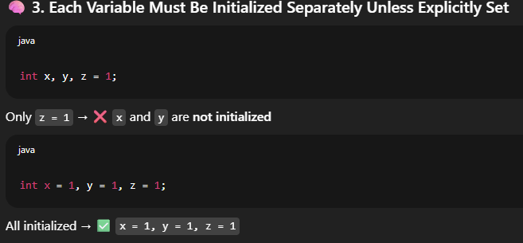

### ⚡july4

- in java `i++` vs `++i`

 
### ⚡july11


# 🎯a level-One Heading
## 🎯a level-Two Heading
### 🎯a level-Three heading (no line seprator)
#### 🎯important Bullet Points

- one
- two
- three

#### numerical Points
1. First
2. Second
3. Thrid

#### list
 - a - dash
 * b * star
 + c + plus 

--------------------- a line
--- 
#### three dash

- __Bold__
- **BoldAgain** also __BoldAgain2__
- **This is _very_ important**
- ***Very vital therefore bold and italic***

## Link
To use a link in your presentation use `[]()` syntax   
- [a link](https://www.google.com)


## Alerts     
**Supported in some markDown preview.But surely will come up on Github preview.**

> [!NOTE]  
> Now here ,write ur remarks.

> [!CAUTION]  
> Now here ,write ur remarks.

> [!Tip]  
> Now here ,write ur remarks.

> [!Warning]  
> Now here ,write ur remarks.

> [!IMPORTANT]  
> Now here ,write ur remarks.

## codeBlockk
- either , triple backtiks` ``` ``` ` or four times`[space][space][space][space]`

```java
public class Demo{
    public static void main(String[] args){
        System.out.println("Hello Python");
    }
}
```
```python
print("Hello Python")
```
## Highlighter
here in this sentense we can ==really highlight== a word.  (not suppoeted in all)
here in this sentense we can <mark> really highlight</mark> a word.  
or 
use single backtick `like this`

## Images
- ``  

Since Markdown doesn’t support resizing images, inline HTML can be used here to accomplish this task.  
- `" height="<height>">`    
--- 

--- 
  inCenter using html,controlling size
<!-- <center>  

</center>    this syntax is outdated. -->
<div align="center">

</div>

>[!IMPORTANT]  
>vsCode supports html style formatting . Therefore,u can see border style and color in vsCode but not on github.     
>In order to see these alerts properly on vsCode u need extentions such as enhanced markdown or all in one md.


## Detailed Click

In md if u a very huge section which u would like to hide in between we can use details ans summary tag   

```md
<details>
<summary>Click to see more</summary>
your content
</details>
```
<br>
<details>
<summary>Click to See a summary</summary>

#### Four-hash 
###  Three-hash
## Two-hash
# One-hash

## List
- Aircraft
  - Fighter Jet
     - rafael 
     - su-30
     - mig-29
  - Transport
     - c-17 GlobeMaster
     - c-130j Super Hercules
     - p-8 Posiden

  - Helicopter  
    - apache
    - Dhruv
    - prachand
    - mi-17

## Image

<div align="center">

</div>

## CodeBlockk
```js
console.log("Hello webJs");
```  


</details>

### usefull emoji
```
🔥🎯♥️♦️🧿🔻💥✅⚡👉👇🐦‍🔥⏩⏬❌⛓️‍💥👆🚩🤖👁️✨
🕹️🪄🗝️🛠️🪛🪓⚙️⛓️‍💥⛓️🔗🛡️⚔️🧣🧱🧬🔎📍📌🚀⚓🪐
❄️💢💫♾️🚫❌⭕❗💡💵💰💸⏰❓‼️⁉️💯☢️⚠️☣️✳️
⬇️↔️↕️🔄️🔝💲🟰➗✖️➖➕🔴🟡🟢🔵⚫⚪🟥🟩🟨🔶
🔸🔷💭🔻🔺🔹
🆗🆕0️⃣1️⃣2️⃣3️⃣4️⃣5️⃣6️⃣7️⃣8️⃣9️⃣🔟▶️🔁◀️🔼🔽➡️⬅️⬆️

```
<!-- java content below -->

### ⚡july12 
- interesting Java
<details>
✅ Java Object References: Declare vs. Initialize    

1️⃣ Declaration only:

>Test obj1;    //You’ve only declared obj1.

- No memory is allocated for an object — just a slot for a reference in the stack.  

⚠️ Compiler Error: You must assign it before you use it.


>System.out.println(obj1); // ❌ compile-time error: might not have been initialized  

2️⃣ Declaration + Initialized to null:

```
Test obj1 = null;  

- Now obj1 is initialized — it points to null, which means “no object.”

- This uses a small amount of stack memory for the reference.  

- No object is created in the heap yet.

✅ System.out.println(obj1); works → prints null.
```

3️⃣ Later you can create the real object:


`obj1 = new Test();`  
Now obj1 points to a real Test object in the heap.   
 
You can safely call obj1’s non-static methods and access non-static fields.     

This works the same for both cases:  

```
Test obj1;       // must assign before use
obj1 = new Test();

Test obj2 = null; 
obj2 = new Test(); // reassigns from null to object
```

✅ Key Points  
Local variables must be initialized before use.    

null means “this reference does not point to any real object.”    

Declaring Test obj = null; is common when you plan to create the object later, conditionally.    

Accessing static members via a null reference works, but accessing non-static members on null throws NullPointerException.  

Example: 
```
Test obj = null;
System.out.println(obj.name1); // ✅ works (static)
System.out.println(obj.name);  // ❌ NullPointerException (non-static)
```

</details>

### ⚡july16

## More on Default Values 

-  “Default Initialization of Instance Variables” ya simply “Default Values”

<details>
<summary>ClickToSee</summary>

### 1. ✅ Why your Builder works even when you don’t call setName()
```java
User usr = new User.Builder()
                    .setAge(31)
                    // .setName("Praka")
                    .build();

      //code run without error , and name appears as null.

```
  - `name ek instance variable hai` — Java automatically default value null assign kar deta hai agar tum usko initialize nahi karte.
  - Isliye `JVM tumhare liye name = null` bana deti hai.

### 2.✅ Why String name1; gives compile error   
```java
String name1;  // local variable
System.out.println(name1); // ❌ Compile-time error: variable might not have been initialized

```
- name1 ek `local variable` hai → `JVM koi default value nahi deta`.



🎯 In Short  
🔹 Local variable = must initialize manually → nahi toh compile-time error.

🔹 Instance variable = JVM gives default → null, 0, false.

🔹 Builder pattern mein agar koi field set nahi hoti → woh default null hoti hai, isliye program crash nahi hota jab tak aap null pe method nahi chalate.
 
### 3. Agar tum User class ke andar String name1; likh dete ho, toh woh ab local nahi balki instance variable ban jayega.

   

<br>
✅✅✅
- name1 ab instance variable hai.
- Java JVM default value dega: String ke liye null, int ke liye 0, boolean ke liye false.  
🚩  


<br>
<br>

**“Default Initialization of Class Members”**
- Jab instance variables (fields) declare hote hain, unko JVM automatically default value assign karti hai agar aap manually koi value nahi dete.

- Ye local variables par apply nahi hota. Local variables ko JVM chhod deti hai, aapko khud initialize karna padta hai.


</details>

---

## ⚡july17
- methodChaining/builderPattern 
- why builderPattern 
- case  of Construcutor
  - bydefault every class will be provided a construcutor by java Class().
  - for if u make Constructor of your own, then default construcutor will not work 
  - u can have mixture of both.(u can write objects both ways 1.byconstrucutor parameters 2. by builderpattern methods)

## ⚡july28

### 1.
  

### 2. 


### 3. 
```java
public class TestVariables {
    public static void main(String[] args) {
        int a, b, c = 5;
        // System.out.println(a); // ❌ Error
        System.out.println(c); // ✅
    }
}
```


