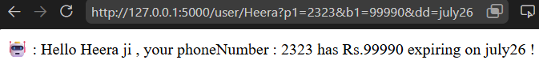

## ⚡july1

<details>

```
╔══════════════════════════════════════════════════════════════════════════════╗
║                 🌐 FLASK ROUTING + QUERY PARAMETERS NOTES                   ║
║                     (Conversation Summary / Copy-Paste)                     ║
╚══════════════════════════════════════════════════════════════════════════════╝


==============================================================================
1. TEMPLATE RENDERING (JINJA)
==============================================================================

❓Question:
Flask me Jinja hota hai, baki languages me kya hota hai?

✅ Answer:

Almost har backend framework ke paas apna template engine hota hai.

Python Flask      -> Jinja2
Python Django     -> Django Templates
Node Express      -> EJS / Pug / Handlebars
Laravel           -> Blade
Ruby on Rails     -> ERB
ASP.NET           -> Razor
Spring Boot       -> Thymeleaf

Sabka concept SAME hai.

Browser
   │
   ▼
Backend
   │
   ▼
Template + Data
   │
   ▼
Final HTML
   │
   ▼
Browser


==============================================================================
2. QUERY PARAMETERS KYA HOTE HAIN?
==============================================================================

URL Example:

/search?name=Ali

name=Ali
ye Query Parameter hai.

Multiple:

/search?name=Ali&age=20&city=Delhi

Rule:

?  -> Query string start karta hai.
&  -> Next parameter separate karta hai.

Structure:

/search
   │
   └────── Path

?name=Ali&age=20
   │
   └────── Query String


==============================================================================
3. FRONTEND QUERY PARAMETER KAISE BHEJTA HAI?
==============================================================================

HTML GET Form:

<form action="/search" method="GET">

Browser automatically URL banata hai.

User enters:

Ali

Browser sends:

/search?name=Ali

--------------------------------

JavaScript:

fetch("/search?name=Ali")

or

fetch(`/search?name=${name}`)


==============================================================================
4. FLASK QUERY PARAMETER KAISE PADHTA HAI?
==============================================================================

Route:

@app.route("/search")

Flask:

request.args.get("name")

URL:

/search?name=Ali

Result:

request.args["name"] == "Ali"


==============================================================================
5. QUERY PARAMETER DESIGN KAUN KARTA HAI?
==============================================================================

❓Kya browser decide karta hai?

❌ Nahi.

Developer decide karta hai.

Example:

Backend:

request.args.get("category")
request.args.get("brand")
request.args.get("page")

Frontend MUST send:

/products?category=Laptop&brand=HP&page=2

Agar frontend bhej de:

/products?department=CSE

Aur backend expect kare:

request.args.get("branch")

Result:

branch = None

Reason:

Parameter names match nahi hue.


==============================================================================
6. QUERY PARAMETERS BANE HI KYU?
==============================================================================

Purpose:

✔ Search
✔ Filter
✔ Pagination
✔ Sorting

Examples:

/products?category=mobile

/search?q=python

/users?page=2

/students?branch=CSE

NOT FOR:

❌ Registration
❌ Login
❌ Payment
❌ Student Form
❌ Password


==============================================================================
7. STUDENT FORM DATABASE ME KAISE JATA HAI?
==============================================================================

Student Form:

Name
College
Branch
Height
Weight
Phone
Score

Question:

Ye query parameter se jayega?

❌ No.

Use POST.

Flow:

HTML Form
      │
      ▼
POST /student
      │
      ▼
request.form
      │
      ▼
INSERT INTO students(...)
      │
      ▼
Database

Reason:

Sensitive & Large Data should go in Request Body.


==============================================================================
8. GET vs POST
==============================================================================

GET

Purpose:

✔ Read
✔ Search
✔ Filter

Example:

GET /products?category=laptop

Meaning:

"Mujhe laptops dikhao."

--------------------------------

POST

Purpose:

✔ Create
✔ Save Data

Example:

POST /students

Body:

{
 name:"Ali",
 branch:"CSE"
}

Meaning:

"Ye database me save karo."

--------------------------------

Convention:

GET      -> Read
POST     -> Create
PUT      -> Replace
PATCH    -> Update
DELETE   -> Delete

NOTE:

Technically developer kuch bhi kar sakta hai.

Lekin industry convention yehi follow karti hai.


==============================================================================
9. ROUTE MATCHING FLASK ME KAISE HOTA HAI?
==============================================================================

Suppose:

@app.route("/pro")

Only this exists.

Links:

/pro
/pro/a
/pro/a/b
/pro/z

Result:

/pro       ✅

Everything else:

❌ 404

Reason:

Flask Exact PATH Match karta hai.

"/pro"

is NOT same as

"/pro/a"

Every route independent hota hai.


==============================================================================
10. AGAR BAAD ME /pro/a BANA DIYA?
==============================================================================

@app.route("/pro")

@app.route("/pro/a")

Result:

/pro       ✅

/pro/a     ✅

/pro/a/b   ❌

Again:

Exact Match.


==============================================================================
11. AGAR SUBPATH CHAHIYE?
==============================================================================

Flask:

@app.route("/pro/<path:subpath>")

Then:

/pro/a

subpath = "a"

---------------------------

/pro/a/b

subpath = "a/b"

---------------------------

Ek hi route sabko handle kar lega.


==============================================================================
12. SABSE IMPORTANT DOUBT
==============================================================================

Question:

Agar Flask exact route match karta hai...

To

/pro?a=4&b=3

kaise match ho gaya?


==============================================================================

ANSWER
==============================================================================

Browser URL ko internally 2 parts me tod deta hai.

URL:

/pro?a=4&b=3

Internally:

PATH

/pro

QUERY STRING

a=4&b=3

Flask Route Matching:

ONLY PATH

NOT QUERY STRING

Diagram:

                URL
                 │
     ┌───────────┴────────────┐
     │                        │
     ▼                        ▼

  /pro                  a=4&b=3

 Route Match         request.args

----------------------------------

Flask checks:

@app.route("/pro")

PATH == "/pro"

YES

Route matched.

Then:

request.args["a"]

returns

4


==============================================================================
13. WHY ONLY ONE "?"
==============================================================================

Question:

Why not

/pro?name=Ali?age=20?city=Delhi

Answer:

URL grammar.

Only ONE "?" starts Query String.

Everything after that is separated by "&".

Correct:

/pro?name=Ali&age=20&city=Delhi

Reason:

Parser ko pata hona chahiye

where Query starts
and
where next parameter begins.

Grammar:

Path

/products

↓

?

↓

Query Starts

↓

name=Ali

↓

&

↓

age=20

↓

&

↓

city=Delhi


==============================================================================
14. QUERY PARAMETERS ARE EXTRA INSTRUCTIONS
==============================================================================

Think like Courier.

Address:

House No.25

Extra Instructions:

Call before delivery.
Leave at gate.

Courier first sees:

House No.25

Then instructions.

Similarly:

/products

↓

Route Match

Then

?category=mobile&page=2

↓

Extra Instructions

↓

request.args


==============================================================================
15. GOLDEN RULES ⭐
==============================================================================

URL = PATH + QUERY

Example:

/products?category=laptop&page=2

PATH

/products

↓

Matched by

@app.route("/products")

--------------------------------

QUERY

category=laptop

page=2

↓

Read by

request.args


==============================================================================
16. EASY MEMORY
==============================================================================

GET + Query Parameters

↓

"I want something."

Examples:

Search
Filter
Pagination

--------------------------------

POST + Request Body

↓

"I am sending something."

Examples:

Registration
Login
Payment
Insert Student
Upload Data

--------------------------------

Flask Route

↓

Only matches PATH

--------------------------------

request.args

↓

Reads Query Parameters

--------------------------------

request.form / request.json

↓

Reads POST Body


==============================================================================
17. FINAL MENTAL MODEL
==============================================================================

                      Browser
                         │
                         ▼
         /products?category=Laptop&page=2
                         │
                         ▼
            ┌──────────────────────────┐
            │ PATH = /products         │
            │ QUERY = category,page    │
            └──────────────────────────┘
                    │
                    ▼
          Flask checks ONLY PATH
                    │
                    ▼
      @app.route("/products")   ✅ MATCH
                    │
                    ▼
    request.args["category"] = Laptop
    request.args["page"]     = 2
                    │
                    ▼
          Database Query Executes
                    │
                    ▼
             Response to Browser


═══════════════════════════════════════════════════════════════════════════════
🚀 ONE-LINE MEMORY
═══════════════════════════════════════════════════════════════════════════════

Route (/products)         ➜ "Where should the request go?"

Query Parameters (?)      ➜ "What exactly do I want?"

POST Body                 ➜ "Here is the data I want to save."

Flask Route Matching      ➜ ONLY PATH

request.args              ➜ GET Query Parameters

request.form/request.json ➜ POST Request Body

GET                       ➜ Read/Search

POST                      ➜ Create/Save

PUT/PATCH                 ➜ Update

DELETE                    ➜ Delete

═══════════════════════════════════════════════════════════════════════════════
```

</details>


<details>
<summary>✨REST API DESIGN ESSENTIAL'S✨</summary>

## start

# 🚀 REST API Design - The Foundation Every Backend Developer Must Know

> **Goal:** Is document ko padhne ke baad tum REST API design khud soch paoge.
>
> Hum sirf syntax nahi seekhenge.
> Hum **philosophy (thinking process)** seekhenge.

---

# 📖 Chapter 1 - Imagine the Internet

Imagine ek restaurant hai.

```
                   🌍 Internet

        +---------------------------+
        |        Customer           |
        | (Browser / Mobile App)    |
        +------------+--------------+
                     |
              HTTP Request
                     |
                     ▼
        +---------------------------+
        |         Restaurant        |
        |   (Backend / Flask API)   |
        +------------+--------------+
                     |
                 Kitchen
               (Database)
```

Customer kabhi kitchen ke andar nahi jaata.

Wo bas waiter ko bolta hai

> "Ek Burger laana."

Backend bhi exactly waise hi kaam karta hai.

Frontend database ko touch nahi karta.

Wo bas request bhejta hai.

---

# 📖 Chapter 2 - API kya hota hai?

API = Waiter 🍽️

```
Customer
    |
    |
    ▼
 Waiter (API)
    |
    |
    ▼
 Kitchen
```

Customer ko kitchen ka structure nahi pata.

Usko bas itna pata hai

```
Order do

↓

Food aa jayega
```

Backend mein bhi

```
Frontend

↓

API

↓

Database
```

---

# 📖 Chapter 3 - HTTP Request

Har request ke 4 major parts hote hain.

```
+--------------------------------+

Method

URL

Headers

Body

+--------------------------------+
```

Example

```
POST /users

Body

{
   "name":"Rahul",
   "age":20
}
```

---

# 📖 Chapter 4 - Method kya hota hai?

Method ek **Verb** hai.

Ye batata hai

> "Main kya karna chahta hu?"

Jaise English mein

```
Eat

Run

Sleep

Write
```

Waise HTTP mein

```
GET

POST

PUT

PATCH

DELETE
```

---

# 📖 Chapter 5 - Resource kya hota hai?

REST mein sab kuch **Resource** hota hai.

Imagine database

```
Users

Orders

Products

Cars

Books

Students
```

Ye sab Resources hain.

REST ka golden rule

> **URL should represent NOUNS, not VERBS.**

✅ Good

```
/users

/books

/orders

/products
```

❌ Bad

```
/createUser

/deleteBook

/getProducts

/updateOrder
```

Reason?

Action already HTTP Method bata raha hai.

---

# 📖 Chapter 6 - Method + Resource = Complete Sentence

Dekho magic

```
POST /users
```

English

```
Create User
```

---

```
GET /users
```

English

```
Read Users
```

---

```
DELETE /users/5
```

English

```
Delete User 5
```

---

```
PUT /users/5
```

English

```
Replace User 5
```

Notice

URL mein verb nahi hai.

Verb already method hai.

---

# 📖 Chapter 7 - CRUD

Sab applications ultimately yehi karti hain.

```
Create

Read

Update

Delete
```

ASCII

```
             CRUD

        +------------+
        |  CREATE    |
        +------------+
              |
              ▼
        +------------+
        |   READ     |
        +------------+
              |
              ▼
        +------------+
        |  UPDATE    |
        +------------+
              |
              ▼
        +------------+
        |  DELETE    |
        +------------+
```

Mapping

```
Create → POST

Read → GET

Update → PUT / PATCH

Delete → DELETE
```

---

# 📖 Chapter 8 - GET

Purpose

📖 Read data

```
GET /users
```

Meaning

```
Give me users.
```

Example

```
GET /books
```

Server

```
[
   Book1,
   Book2,
   Book3
]
```

Rule

✅ Should NOT change database.

Imagine

```
GET /balance
```

Should NOT become

```
Balance++

```

Read means

Read only.

---

# 📖 Chapter 9 - POST

Purpose

✨ Create something

Example

```
POST /users
```

Body

```
{
   "name":"Rahul"
}
```

Database before

```
Users

1

2

3
```

After

```
Users

1

2

3

4
```

POST generally creates NEW data.

---

# 📖 Chapter 10 - PUT

Purpose

🔄 Replace entire resource.

Example

Before

```
User

{
 name : Rahul
 age : 20
 city : Delhi
}
```

PUT

```
PUT /users/1
```

Body

```
{
 name : Aman
 age : 30
 city : Jaipur
}
```

After

```
User

{
 name : Aman
 age : 30
 city : Jaipur
}
```

Entire object replaced.

---

# 📖 Chapter 11 - PATCH

Purpose

🩹 Update only few fields.

Before

```
Rahul

20

Delhi
```

PATCH

```
{
 age : 21
}
```

After

```
Rahul

21

Delhi
```

Only age changed.

---

# 📖 Chapter 12 - DELETE

Purpose

🗑 Remove resource.

```
DELETE /users/5
```

Database

Before

```
1

2

3

4

5
```

After

```
1

2

3

4
```

---

# 📖 Chapter 13 - URL Design

Imagine

```
Library

Books

Authors

Students
```

REST URLs

```
/books

/books/5

/authors

/authors/2

/students

/students/50
```

Very clean.

---

# 📖 Chapter 14 - Nested Resources

Example

```
One user

↓

Many posts
```

Tree

```
User

├── Post

├── Post

├── Post
```

URL

```
GET /users/5/posts
```

Meaning

> Give me posts of user 5.

---

# 📖 Chapter 15 - Query Parameters

Suppose

10000 users hain.

Tum sirf active users chahte ho.

```
GET /users?active=true
```

Ya

```
GET /products?category=mobile
```

Ya

```
GET /books?page=2
```

Query parameters

Filtering

Searching

Sorting

Pagination

ke liye hote hain.

---

# 📖 Chapter 16 - Path Parameters

```
GET /users/5
```

Yahan

```
5
```

Path parameter hai.

Meaning

Specific resource.

---

# 📖 Chapter 17 - Request Body

Sirf GET hi sab kuch URL se nahi bhejta.

POST

PUT

PATCH

mostly body use karte hain.

Example

```
POST /users

Body

{
 name:"Rahul"
}
```

---

# 📖 Chapter 18 - Status Codes

Server answer bhi deta hai.

```
200

Everything OK
```

```
201

Created
```

```
400

Client made mistake
```

```
401

Login required
```

```
403

Permission denied
```

```
404

Not found
```

```
500

Server error
```

Easy trick

```
2xx 😊 Success

3xx 🔀 Redirect

4xx 🙋 Client mistake

5xx 💥 Server mistake
```

---

# 📖 Chapter 19 - Idempotency

Ye word beginners ko dara deta hai.

Actually simple hai.

Imagine switch.

```
ON

ON

ON

ON
```

Switch already ON hai.

Kitni baar ON dabao

Result same.

Ye

Idempotent.

---

PUT

```
PUT /users/5
```

Again

```
PUT /users/5
```

Again

```
PUT /users/5
```

Same result.

---

POST

```
POST /orders
```

Again

```
POST /orders
```

Again

```
POST /orders
```

Teen orders ban gaye.

Isliye

POST idempotent nahi.

---

# 📖 Chapter 20 - Why Follow REST Rules?

Question

> Agar GET se delete kar sakte hain to rules follow kyu?

Excellent question.

Imagine

```
🚗 Road
```

Sabko rule pata hai.

```
Red

↓

Stop
```

Technically

Barrier nahi hai.

Tum cross kar sakte ho.

Lekin

```
🚓 Police

💥 Accident

😵 Other drivers confused
```

Exactly same

REST mein.

Agar tum

```
GET /deleteUser
```

likh doge

to

Browser

Proxy

CDN

Cache

Search Engine

API Client

sab confuse ho jayenge.

REST is a **contract**.

Not a compiler restriction.

---

# 📖 Chapter 21 - REST Design Mindset

Har API banane se pehle ye 5 questions pucho.

```
① Resource kya hai?

User?

Book?

Order?

Product?
```

↓

```
② Action kya hai?

Read?

Create?

Update?

Delete?
```

↓

```
③ Resource single hai ya collection?

/users

ya

/users/5
```

↓

```
④ Data URL mein jayega?

ya

Body mein?
```

↓

```
⑤ Success pe kaunsa status code?
```

Bas.

90% REST design isi thinking se ban jaata hai.

---

# 📖 Chapter 22 - Complete Example

Imagine Instagram clone.

```
Resources

Users

Posts

Comments

Likes
```

APIs

```
GET     /users

GET     /users/5

POST    /users

PUT     /users/5

PATCH   /users/5

DELETE  /users/5
```

Posts

```
GET     /posts

GET     /posts/8

POST    /posts

DELETE  /posts/8
```

Comments

```
GET     /posts/8/comments

POST    /posts/8/comments

DELETE  /comments/25
```

Sab APIs same pattern follow kar rahi hain.

Isliye koi bhi developer project dekhte hi samajh jaata hai.

---

# 🌟 The Golden Rules (Frame This 🖼️)

```
✅ URL = Noun (Resource)

❌ URL = Verb
```

```
GET
```

📖 Read

Database should NOT change.

---

```
POST
```

✨ Create

New resource.

---

```
PUT
```

🔄 Replace complete resource.

---

```
PATCH
```

🩹 Update only required fields.

---

```
DELETE
```

🗑 Remove resource.

---

```
Collection

/users
```

```
Single Resource

/users/5
```

---

```
Query Parameters

?page=2

?search=rahul

?active=true
```

---

```
Path Parameters

/users/5
```

---

```
Status Codes Matter
```

```
200 OK

201 Created

400 Bad Request

401 Unauthorized

403 Forbidden

404 Not Found

500 Internal Server Error
```

---

# 🧠 Final Mental Model

Whenever you design an API, think in this sentence:

```
            🌍 Client
                │
                ▼
      "I want to perform an action"
                │
                ▼
      Choose HTTP Method (Verb)
                │
                ▼
      Select Resource (Noun)
                │
                ▼
      Build Clean URL
                │
                ▼
      Send Body (if needed)
                │
                ▼
      Server Processes Request
                │
                ▼
      Return Status Code + JSON
```

## 💎 The One Sentence to Remember Forever

> **REST API design is not about memorizing GET, POST, PUT, and DELETE. It is about expressing an action (HTTP Method) on a resource (URL) using a shared contract that every client, server, browser, cache, and developer understands.**

Agar ye sentence samajh aa gaya, to REST API ki foundation mazboot ho gayi.

</details>

### flask route's

```python
@app.route('/puppy/<name>')
def puppy_latin(name):
    ...
   
```

Iska matlab Flask ko tum keh rahe ho:

`"/puppy/ fix hai. Lekin uske baad jo bhi text aayega, usko name variable me store kar dena."`


## july2

### decorator revision
```python 
def outer():

    def inner():
        print("Hello")

    return inner

x = outer()

print(x)

x()

# output
<function outer.<locals>.inner at 0x...>

Hello

```

<details>
<summary>QnA</summary>

```text
╔══════════════════════════════════════════════════════════════════════════════════════╗
║                     🚀 AI / ML / LLM COMPLETE BEGINNER SUMMARY                     ║
╚══════════════════════════════════════════════════════════════════════════════════════╝

📌 1. AI, ML, DL, LLM Relationship

AI (Artificial Intelligence)
│
├── Machine Learning (ML)
│      └── Learns patterns from data instead of hardcoded rules
│
├── Deep Learning (DL)
│      └── Uses Neural Networks (many layers)
│
├── LLM (Large Language Model)
│      └── Specialized Deep Learning model for language
│
├── Computer Vision
├── Robotics
└── Reinforcement Learning


======================================================================================
📌 2. AI vs Encyclopedia
======================================================================================

📖 Encyclopedia

- Stores facts directly.

Example

India → Capital = Delhi
Japan → Capital = Tokyo
Moon Distance = 384400 km

It only retrieves stored information.


🤖 LLM

Does NOT store pages like Wikipedia.

Instead it learns

✅ Language
✅ Relationships
✅ Patterns
✅ Concepts

Example

It has seen millions of sentences like

Apple is a fruit.
Apple grows on trees.
Apple is red.

It learns

Apple
   ↓
Fruit
   ↓
Tree
   ↓
Red

Not as text pages...
but as learned mathematical patterns.


======================================================================================
📌 3. What is inside an LLM?
======================================================================================

NOT

Database
Wikipedia
Dictionary

Instead

Billions of numbers

called

➡ Parameters (Weights)

Example

0.134
-1.992
4.551
0.0008
...

GPT-like models may have

Billions of these weights.

These weights collectively represent learned knowledge.


======================================================================================
📌 4. How does LLM answer?
======================================================================================

Input

"The capital of France is"

Model predicts

Paris      99%
London      0.5%
Delhi       0.2%

Outputs

Paris


Another Example

"Twinkle Twinkle Little"

Prediction

Star 99%

Output

Star

LLM predicts the NEXT TOKEN repeatedly.


======================================================================================
📌 5. Grammar Learning
======================================================================================

Nobody manually teaches grammar.

Model sees billions of examples.

I am going.
He is running.
They are playing.

So

"He are"

looks statistically wrong.

Model predicts

"He is"


======================================================================================
📌 6. Math
======================================================================================

LLM is NOT a calculator.

It learned mathematical patterns.

Small math

23 + 45

✅ Usually correct

Huge calculations

May fail.

Modern AI often calls

Python
Calculator
External Tools

for exact answers.


======================================================================================
📌 7. Reasoning / Puzzle Solving
======================================================================================

LLM has seen

Millions of

Logic problems
Coding
Puzzles
Reasoning examples

It generalizes patterns.

It is NOT memorizing every puzzle.


======================================================================================
📌 8. Offline AI
======================================================================================

Yes.

If model is downloaded

Internet OFF

↓

Still answers questions.

But...

Recent news

IPL yesterday

Latest elections

No.

Because knowledge stops at training cutoff.


======================================================================================
📌 9. Decorator Example
======================================================================================

Original

def greet():
    print("Hello")

Then

greet = my_decorator(greet)

becomes

greet = wrapper

So

greet()

actually calls

wrapper()

Inside wrapper

print("Before")
func()      ← original greet()
print("After")

Output

Before
Hello
After


======================================================================================
📌 10. AI Web App Project
======================================================================================

Recommended Architecture

User
 │
 ▼
React
 │
 ▼
FastAPI
 │
 ▼
LLM API
 │
 ▼
Response

Good Portfolio Project ✅


======================================================================================
📌 11. Local vs API
======================================================================================

LOCAL

Pros
✔ Offline
✔ Privacy

Cons
❌ Heavy
❌ GPU needed


API

Pros
✔ Fast
✔ Easy
✔ Cheap
✔ Production Ready

Examples

Groq
OpenRouter
HuggingFace


======================================================================================
📌 12. EC2 Deployment Architecture
======================================================================================

User
 │
 ▼
React
 │
 ▼
Nginx
 │
 ▼
FastAPI
 │
 ▼
LLM API
 │
 ▼
Answer

Docker Compose

frontend/
backend/
nginx/
redis(optional)

Perfect beginner production architecture.


======================================================================================
📌 13. Self Hosting LLM
======================================================================================

If later hosting your own model

User
 │
 ▼
React
 │
 ▼
FastAPI
 │
 ▼
vLLM / Ollama
 │
 ▼
Qwen / Llama

Needs GPU.


======================================================================================
📌 14. Can LLM be optimized for India?
======================================================================================

YES.

There are 4 ways.


1️⃣ Prompt Engineering ⭐

"You are IndiaGPT.

Answer only Indian topics."

Easy.


--------------------------------------------------

2️⃣ RAG ⭐⭐⭐⭐⭐ (Industry Standard)

User
 │
 ▼
Question
 │
 ▼
Vector Database
 │
 ▼
Relevant Documents
 │
 ▼
LLM
 │
 ▼
Answer

Data can include

Indian Constitution
NCERT
UPSC Notes
Government Schemes
GST
IPC/BNS
Court Judgements

Best approach.


--------------------------------------------------

3️⃣ Fine Tuning

Retrain model

with

Thousands / Millions of India-specific examples.

Needs GPU.

Expensive.


--------------------------------------------------

4️⃣ Train From Scratch

Very expensive.

Ignore as beginner.


======================================================================================
📌 15. Why RAG is Better?
======================================================================================

Government changes a law.

Fine Tune

↓

Need retraining.

RAG

↓

Replace PDF

Done.

That's why companies love RAG.


======================================================================================
📌 16. AI Learning Roadmap
======================================================================================

1. Python
2. FastAPI / Flask
3. REST APIs
4. React (optional but useful)
5. Docker
6. Git
7. LLM APIs
8. Prompt Engineering
9. Function Calling
10. RAG ⭐⭐⭐⭐⭐
11. Vector Databases
12. AI Agents
13. Fine Tuning
14. Model Hosting


======================================================================================
📌 17. Great Portfolio Projects
======================================================================================

✅ AI Chatbot

✅ PDF Chatbot

✅ Resume Analyzer

✅ SQL Generator

✅ Interview Bot

✅ AI Teacher

✅ LegalGPT

✅ IndiaGPT

✅ Customer Support Bot

✅ Code Explainer


======================================================================================
📌 18. Recommended Production Stack
======================================================================================

Frontend
──────────
React

Backend
──────────
FastAPI

Reverse Proxy
──────────
Nginx

Container
──────────
Docker

Database
──────────
PostgreSQL

Cache
──────────
Redis

AI
──────────
Groq API
or
OpenRouter

Deployment
──────────
AWS EC2


======================================================================================
📌 19. Key Beginner Misconceptions
======================================================================================

❌ AI = Database

NO.

--------------------------------

❌ AI = Wikipedia

NO.

--------------------------------

❌ AI memorizes everything

NO.

--------------------------------

✅ AI learns statistical patterns.

--------------------------------

✅ Knowledge is compressed into billions of weights.

--------------------------------

✅ LLM predicts the next token repeatedly.

--------------------------------

✅ Grammar, coding, reasoning and writing emerge from
learning patterns over massive datasets.


======================================================================================
📌 20. One-Line Mental Model
======================================================================================

AI
│
├── ML → Learns Patterns
│
├── DL → Neural Networks
│
├── LLM → Learns Language
│
├── Prompt → Controls Behaviour
│
├── RAG → Gives External Knowledge
│
├── Fine Tune → Changes Model Behaviour
│
└── API/Deployment → Makes It a Real Product


🎯 Golden Rule

Knowledge  ≠  Stored like an encyclopedia.

Knowledge  =  Encoded inside billions of learned mathematical weights.

Response = Context + Learned Patterns + Next Token Prediction.
```


</details>


```
def test():
    print("A")
    return 5
    print("B")

print(test())
```


## ⚡july4

```
🏆 Production Mindset

In real backend:

GET never changes state
POST creates new resource
PUT updates
DELETE removes
All data saved using DB layer
```
### `Data saves only if you explicitly write logic to store it.`
### `HTTP method does not automatically save anything.`


## ⚡july5

**Query Parameter**


```
3️⃣ So how do we send POST from a browser?

There are 3 main ways.

1️⃣ HTML form
2️⃣ JavaScript (fetch / axios)
3️⃣ API tools (Postman / curl)

For real websites:

HTML form or JavaScript
```

## ⚡july6

```
4️⃣ So Now You Know 3 Places Data Can Come From

Very important backend concept.

CLIENT REQUEST
      │
      ▼
+-------------------+
| request object    |
+-------------------+
| args  → URL query |
| form  → form body |
| json  → JSON body |
+-------------------+

Example:

DataType	          Example	          Flask Access
URL path	         /user/anna	      function parameter
Query parameter	    ?age=25	          request.args
Form body	        POST form	      request.form
```

### 4️⃣ Important Security Reality

```md
# Once the JS file is sent to the browser:

User can see the code
User can copy it
User can modify it

Because frontend code is always visible.

That’s why:

Score validation
Leaderboard
User authentication

must be handled by backend.
```
<!-- 
```MD
# print(hello)
``` -->


## ⚡7july

```python
@app.route('/userdetail', methods=['GET', 'POST'])
def userdetail():
    if request.method == 'POST':
        name = request.form['name']
        city = request.form['city']
        phone = request.form['phone']
        branch = request.form['branch']

        return render_template('userdetail.html',
                               name=name,
                               city=city,
                               phone=phone,
                               branch=branch)
    else:
        return render_template('userdetail.html')
```

- Browser POST request ka actual data format kya hota hai?
- Try this:
```
👉 2 buttons same form me daal
👉 backend me print:

print(request.form)

👉 aur dekho kya difference aata hai
```
-
```
 🎯 10. Mini Task

👉 Same data 2 ways se bhej:

HTML form
JS fetch

👉 Flask me print:

print(request.form)
print(request.json)

👉 Difference samajh

❓ Answer these
```
<hr>

🔥 4. REAL INDUSTRY PATTERN (IMPORTANT)

👉 Try-Catch use hota hai

```python
@app.route('/register', methods=['POST'])
def register():
    try:
        name = request.form['name']

        cursor.execute("INSERT INTO users (name) VALUES (%s)", (name,))
        db.commit()

        return {"status": "success", "message": "Saved successfully"}

    except Exception as e:
        return {"status": "error", "message": "Failed to save"}
```

