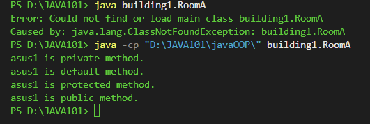
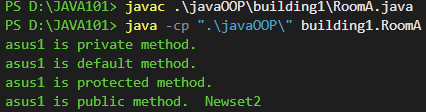
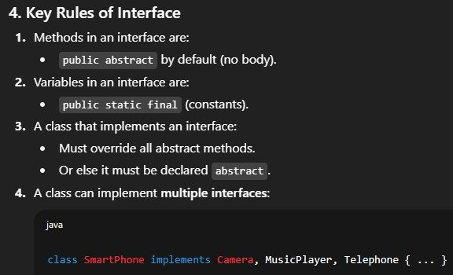
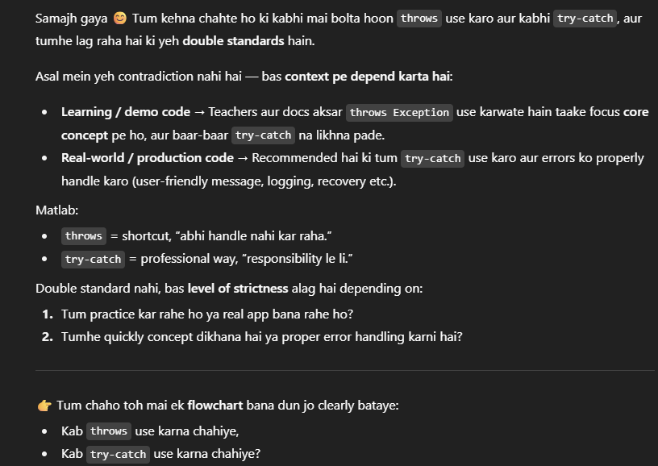
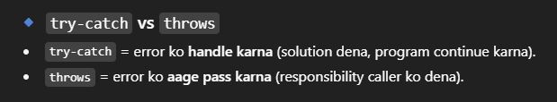

### ⚡ sep1

<details>

Reference type (left side)  
`Shape xx = ... ;`  
→ yahan Shape sirf ek reference type hai. Matlab compiler dekhega ki tum iss variable se Shape class/Interface ke andar declare kiye gaye methods hi call kar sakte ho.  

Object type (right side)   

new Circle(cx101, 5);  
 
- yahan constructor call ho raha hai Circle ka. Iska Shape se direct lena-dena nahi hota, kyunki constructor subclass mein hi defined hota hai.   

Tumhari line ko tod ke samjhte hain:   
`Shape xx = new Circle(cx101, 5);`  

Step 1: new Circle(cx101, 5)  
- Ye call karega Circle class ka constructor (agar tumne banaya hai).  
Example:  
```java

class Circle extends Shape {
    String name;
    int radius;

    Circle(String name, int radius) {
        this.name = name;
        this.radius = radius;
    }
}

```

Matlab compiler pehle check karega ki Circle class me aisa constructor exist karta hai ya nahi.  

Step 2: Shape xx = (that Circle object)  
- Ab wo Circle ka object ban gaya hai, lekin tum uska reference ek Shape type variable me store kar rahe ho.
Ye upcasting hai → subclass object ko superclass reference me daalna. Ye hamesha legal hai (agar inheritance relation hai).

Tumhara doubt:  

👉 "Shape class mei tou Circle constructor hoga nahi jo ye line handle kr sake??"  

Bilkul sahi pakda! ✅  

- Shape me Circle ka constructor hona zaroori nahi hai.  

- Circle ka constructor sirf Circle ke andar hi hota hai, wahi call hota hai.

Shape xx ka matlab sirf ye hai ki:  

- Tum xx se sirf wo methods call kar sakte ho jo Shape me declare hain.  

- Tum Circle-specific methods (jo Shape me nahi hain) directly xx se call nahi kar paoge.

Example full code:
```java
class Shape {
    void draw() {
        System.out.println("Drawing shape...");
    }
}

class Circle extends Shape {
    String name;
    int radius;

    Circle(String name, int radius) {
        this.name = name;
        this.radius = radius;
    }

    void draw() {
        System.out.println("Drawing circle " + name + " with radius " + radius);
    }

    void circleOnlyMethod() {
        System.out.println("This is only in Circle");
    }
}

public class Demo {
    public static void main(String[] args) {
        Shape s = new Circle("cx101", 5);

        s.draw();              // ✅ Allowed (declared in Shape, overridden in Circle)
        // s.circleOnlyMethod(); // ❌ Not allowed (Shape doesn't know this method)
    }
}


Output:

Drawing circle cx101 with radius 5

```

👉 So short answer:  

>new Circle(cx101, 5) → Circle ka constructor chal raha hai.  

>hape xx → reference type restrict karta hai ki tum Shape ke declared methods hi call kar pao.

>Constructor hamesha subclass me hi hota hai, superclass me nahi.
</details>





|||
|:---:|:---:|
|Compile|javac /folder/subfolder/packageName/UrCode.java|
|Run|java -cp  "/folder/subfolder/" packageName.UrCode|

### ⚡sep2

- more on javac --> java
>✅ Rule of thumb:    
>- Code likhte waqt: Always use package xyz;
>- Compile: javac full/path/to/File.java
>- Run: java packageName.ClassName (starting from the root folder above package).

### ⚡sep3

- access modifier 
- singleton class
- Yes, there is a naming convention for Java packages:  
    - All lowercase letters are used (e.g., packone, com.example.project).
    - Reverse domain name is often used for unique package names (e.g., com.companyname.project).
    - No underscores or special characters; use only letters and numbers.
    - Short, meaningful names that reflect the functionality or grouping.  

Your package name packOne should ideally be packone to follow conventions.

- encountered a huge problem in Eclipse ,
  - shoould not name package with capital ltrs, only use lowercase and numbers
  - delete the bin , clean the project 
  - rename the packages properly .

  >`Always remeber for class, only two modifiers -- default/noModifier and public`


  ### ⚡sep4

    
 


### ⚡sep5

- Happy Onam;

### ⚡sep7
<details>
<summary>Return Type and Object Type</summary>

Yes, you are correct!

In Java, the statement:

````java
ReturnType instance = new ObjectType();
````

means that `ObjectType` must be the same as `ReturnType` or a subclass (or implementation, if `ReturnType` is an interface) of `ReturnType`.  
- If `ObjectType` is **not** a subclass or does **not** implement `ReturnType`, you will get a compile-time error:  
`incompatible types: ObjectType cannot be converted to ReturnType`

This is the basis of **polymorphism** in Java.  
- The reference type (`ReturnType`) decides what methods/fields are accessible.
- The actual object type (`ObjectType`) decides which overridden methods run at runtime.

**Example:**

````java
Animal a = new Dog(); // Dog extends Animal -- OK
Animal a = new String(); // ❌ Error: String is not a subclass of Animal
````

So yes, your understanding is correct!
</details>


### ⚡sep8

>Blender jarur seekhna hai;

### ⚡sep9

| **Type of Inner Class**    | **Access to Outer Instance (Non-static) Members**                                                                                       | **Access to Outer Static Members** | **Access to Outer Private Members**                                      | **Key Statements / Notes**                                                                                                                                                 |
| -------------------------- | --------------------------------------------------------------------------------------------------------------------------------------- | ---------------------------------- | ------------------------------------------------------------------------ | -------------------------------------------------------------------------------------------------------------------------------------------------------------------------- |
| **Non-static Inner Class** | ✅ Yes (directly, because it has an implicit reference to the **enclosing class** instance)                                              | ✅ Yes                              | ✅ Yes                                                                    | - Always tied to an instance of the enclosing class.<br>- Can use both static and non-static members of the enclosing class.                                               |
| **Static Nested Class**    | ❌ Cannot access non-static members directly.<br>✅ Can access them **only if you explicitly create an instance of the enclosing class**. | ✅ Yes (directly)                   | ✅ Yes (but for non-static ones, still needs an enclosing class instance) | - Behaves like a top-level class, just namespaced inside the enclosing class.<br>- **Non-static members cannot be used inside a static thing without making an instance**. |


### ⚡sep14

- `https://youtu.be/EfWlJ9-1fVw`

- `#ff2d57`

### ⚡sep19

- `https://youtu.be/EfWlJ9-1fVw`

- #ff2d57

- `https://youtu.be/QHHn0oOGfFg`

- `https://youtu.be/O3BUHwfHf84`

### ⚡sep20

<details>

Skip to content
Chat history

You said:
package errorhandling;

import java.util.Arrays;

public class ErrorStack {

	public static void main(String[] args) {
		
//		level3();
		
		try {
			level1();
		}
		catch(Exception e) {
			System.out.println(e.toString());
		}	
		

	}
	
	
	static void level1() {
		level2();
	}
	static void level2() {
		level3();
	}
	
	static void level3() {
		int[] array = new int[5];
		array[4] = 55;
//		System.out.println(array[4]+" "+array[0]+" "+array[2]);
		System.out.println(Arrays.toString(array));
		System.out.println(array[5]);
	}

}

ye example kyu sekkhaty hian 

samjh aa raha ki level1 ka code ultimatley level3 ko run karyga 


what thy wan tot teach in this example ??
ChatGPT said:
Good question 👍

Tum bilkul sahi samajh rahe ho ki level1() → level2() → level3() call hoti hai, aur ultimately level3() mein jo error hoga, woh propagate hoke main() ke try-catch block mein handle hoga.

Yeh example tumhe basically Exception Propagation aur Stack Trace ka flow sikhata hai.

Breakdown:
Method chaining (nested calls)

main() → level1() → level2() → level3()
Yeh intentionally aise banaya gaya hai taake dikhaya ja sake ki agar koi error neeche waale method mein aata hai (yani level3()), toh woh directly sirf wahin handle nahi hota, balki call chain ke through propagate hota hai jab tak koi try-catch use na kare.

Error generation

array[5] access karte waqt ArrayIndexOutOfBoundsException aayega, kyunki array size 5 hai (last index 4 hota hai).
Matlab deliberately error daala gaya hai taake exception throw ho.

Error handling

main() mein try-catch hai, isiliye exception wahan catch hoga aur System.out.println(e.toString()); print karega.
Agar try-catch hata dete, toh program crash ho jata aur pura stack trace dikhta.

What the teacher wants to show

Exception kaise throw hote hain ek method se dusre method tak.

Exception ko kahaan handle karna chahiye (jis level pe tum decide karo).

Agar exception handle na karo, toh stack trace kaisa dikhta hai (line numbers ke saath).

Samjhne wali baat:
Tumne dekha: error level3() mein hai, lekin handle main() mein kiya gaya.

Matlab, tum apne program mein decide kar sakte ho ki exception ko turant handle karna hai ya upper-level method tak propagate hone dena hai.

👉 So short me:
Yeh example tumhe Exception Propagation aur Stack Trace samjhata hai — error neeche waali method se aata hai aur chain ke through upar tak jata hai jab tak usko pakda (catch) na jaaye.

Chaho toh main tumhare liye ek stack-trace ka output bhi explain kardu line by line, taake aur clear ho jaye?

You said:
what if agr mei tyr catch keval level3 mei rakh deta  ?
ChatGPT said:
Acha sawaal 👌

Agar tum try-catch sirf level3() mein daal do, toh exception wahin catch ho jaayega aur upar propagate nahi hoga.

Example:
static void level3() {
    try {
        int[] array = new int[5];
        array[4] = 55;
        System.out.println(Arrays.toString(array));
        System.out.println(array[5]);  // yaha error aayega
    }
    catch (Exception e) {
        System.out.println("Caught in level3: " + e.toString());
    }
}
Ab flow kya hoga:
level3() mein jab array[5] access karoge → ArrayIndexOutOfBoundsException throw hoga.

Kyunki try-catch level3 ke andar hi hai, woh turant catch ho jaayega.

Exception upar (level2, level1, main) tak propagate nahi hoga.

Output kuch aisa hoga:

[0, 0, 0, 0, 55]
Caught in level3: java.lang.ArrayIndexOutOfBoundsException: Index 5 out of bounds for length 5
Difference (main vs level3 me catch karna)
Catch in main() → Tumko dikhata hai propagation aur stack trace. Useful when tum central location pe exceptions handle karna chahte ho.

Catch in level3() → Exception wahin handle ho jaata hai, upar methods ko pata bhi nahi chalta. Useful jab tumhe local fix / custom handling karni ho.

👉 So basically:

Agar tum level3 mein catch karte ho, toh woh error wahi consume ho jaata hai.

Agar tum catch sirf main() mein karte ho, toh tumko full propagation ka behaviour samajhne ko milta hai.

Kya tum chahte ho main ek diagram banake stack propagation vs local handling dono scenarios side-by-side samjhaun?

You said:
aacah what if i apply throws Exception in the main method itself will it catcha nay error??
ChatGPT said:
Bahut badiya 👏 — yeh ek subtle point hai jo confuse karta hai.

👉 throws Exception aur try-catch alag cheezein hain.

1. Agar main me throws Exception likho:
public static void main(String[] args) throws Exception {
    level1();
}
Ab tumne bola: "main bhi exception ko handle nahi karega, balki woh bhi exception ko aage throw karega."

Lekin program ke upar aur koi method nahi hota (kyunki JVM main() se start karti hai).

Matlab agar exception aata hai, woh JVM tak propagate ho jaata hai.

Result: Program crash ho jaayega, aur JVM ek stack trace print karegi.

2. Agar main me try-catch likho:
public static void main(String[] args) {
    try {
        level1();
    } catch (Exception e) {
        System.out.println("Caught in main: " + e);
    }
}
Yaha exception catch ho jaata hai.

Program gracefully error handle karta hai.

3. Conclusion:
throws Exception = "mai handle nahi karunga, aage bhej do."

try-catch = "mai khud handle karunga."

main() ke case me, agar sirf throws likh diya, toh koi aur method upar nahi hota, isiliye error JVM ko propagate hota hai aur woh stack trace dikha kar program band kar deta hai.

⚡ Simple rule yaad rakho:

throws sirf bola jaata hai → "responsibility mujhe nahi leni."

try-catch bola jaata hai → "responsibility yahi par le li gayi."

Chaho toh main tumhe ek side-by-side output dikhaun:

ek case me throws Exception in main,

aur ek case me try-catch in main?

You said:
lekin file not found valy case mei tou lekhty hain ?
ChatGPT said:
Haan 👌 bilkul sahi observe kiya tumne.

Jab hum File handling (ya I/O operations) karte hain, toh aksar main ke signature me aisa likha hota hai:

public static void main(String[] args) throws IOException {
    FileReader fr = new FileReader("abc.txt");
    int ch = fr.read();
    System.out.println((char) ch);
    fr.close();
}
❓ Kyun likhte hain throws IOException yahaan?
Checked vs Unchecked Exceptions

ArrayIndexOutOfBoundsException (tumhare example ka error) ek unchecked exception hai → JVM enforce nahi karti ke tum usse handle karo.

IOException / FileNotFoundException ek checked exception hai → Compiler tumhe force karta hai ki ya toh:

try-catch use karke handle karo,

ya method signature me throws likhkar bol do “mai handle nahi kar raha, agle ko handle karna hoga.”

Matlab, bina throws IOException ya try-catch ke code compile hi nahi hoga.

In main method

Jab hum practice / short programs likhte hain, toh aksar main() me throws Exception likh dete hain taake baar-baar try-catch na likhna pade.

Iska matlab hota hai: agar exception aaya toh JVM usse catch karegi aur stack trace print karegi.

✅ Ye shortcut hai, lekin production code me best practice hai ke tum khud try-catch karo aur user ko friendly message do.

⚡ Compare karte hain:
Case 1: throws IOException

public static void main(String[] args) throws IOException {
    FileReader fr = new FileReader("abc.txt"); // file missing
}
👉 Agar file nahi mili, program crash hoga aur JVM bolegi:

Exception in thread "main" java.io.FileNotFoundException: abc.txt (The system cannot find the file specified)
Case 2: try-catch

public static void main(String[] args) {
    try {
        FileReader fr = new FileReader("abc.txt");
    } catch (IOException e) {
        System.out.println("File not found! Please check the filename.");
    }
}
👉 Yaha program crash nahi karega, aur tum apna custom message de sakte ho.

📝 Summary:
Checked exception (e.g. IOException) → compiler tumhe force karega ki handle karo ya declare karo.

Unchecked exception (e.g. ArrayIndexOutOfBoundsException) → compiler force nahi karega, tumhari marzi hai.

main() me throws likhne ka matlab hai: “agar exception aaya toh JVM handle kare (stack trace print karke program terminate kar de).”

👉 Ab bolo: tumhe mai ek table bana kar dikhaun Checked vs Unchecked exceptions ka, taake crystal clear ho jaaye?

You said:
public static void main(String[] args) throws Exception{ 
    FileReader fr = new FileReader("abc.txt"); // file missing

if file not found throw new Exception(file not found)  
}

aisaa nahi kr sakta ??
ChatGPT said:
Aha 👌 tumne ek interesting cheez poochi — bilkul kar sakte ho, lekin thoda samajhna zaroori hai.

1. Tumhara code idea:
public static void main(String[] args) throws Exception {
    FileReader fr = new FileReader("abc.txt"); // file missing
    // if file not found throw new Exception("file not found");
}
Yaha tum manually throw new Exception(...) likhna chahte ho.
Par dhyaan do — FileReader constructor khud hi FileNotFoundException throw karta hai (jo ek subclass hai IOException ka, aur ye ek checked exception hai).
Iska matlab: agar file missing hai, woh automatic exception throw karega — tumhe manually throw likhne ki zaroorat nahi.

2. Lekin agar tum chaho to wrap kar sakte ho
Tum catch karke apna custom exception throw kar sakte ho:

import java.io.*;

public class Main {
    public static void main(String[] args) throws Exception {
        try {
            FileReader fr = new FileReader("abc.txt");
        } catch (FileNotFoundException e) {
            throw new Exception("Custom: File not found!");
        }
    }
}
👉 Ab agar file nahi mili, tumhara custom Exception throw hoga, na ki original FileNotFoundException.

3. Best practice
Java developers normally aisa karte hain:

Agar tumhe sirf inform karna hai user ko → try-catch and print message.

Agar tum apna custom error type banana chahte ho → apna CustomFileNotFoundException class banao aur throw karo.

Example:

class CustomFileNotFoundException extends Exception {
    public CustomFileNotFoundException(String msg) {
        super(msg);
    }
}

public class Main {
    public static void main(String[] args) throws CustomFileNotFoundException {
        try {
            FileReader fr = new FileReader("abc.txt");
        } catch (FileNotFoundException e) {
            throw new CustomFileNotFoundException("abc.txt missing, please provide correct file.");
        }
    }
}
🔑 Summary
Tum directly throw new Exception(...) kar sakte ho, lekin wo usually tab hota hai jab tum apna custom error message ya custom exception dena chahte ho.

Agar tum FileReader use kar rahe ho, toh woh khud hi FileNotFoundException throw karega.

Best practice hai checked exception ko ya toh handle karo (try-catch), ya apna custom exception wrap karke throw karo.

👉 Kya tum chahte ho mai ek comparison output dikhaun:

Normal FileNotFoundException

Custom throw new Exception("file not found")

Apna custom exception class?

You said:
summaries all and make a md file 
ChatGPT said:
I’ve created a Markdown file that summarizes everything we discussed.
You can download it here: java_exceptions_summary.md ✅ 


No file chosenNo file chosen
ChatGPT can make mistakes. Check important info. See Cookie Preferences.


</details>



### ⚡sep21
- studied wrapper class
- Scanner nextInt() issue in a menu like program.   
            
             /n  buffer reader -- it is called .

-     try-with -resource
      try(FileReader file = new FileReader()){
        //gic
      }
      catch(IoExceptin e){
        sysout(e)
      }

      So we dont have to close() the resource's


### sep22


### sep23

- in a while loop `break`vs`retrun`
   - using retrun we can break the while loop.
   - instead of using break;

### ⚡ sep24
 **Key Findings**
<details>
### 1. **condition ke ander dual pupose method chala sakte hain** 

      if(f.createNewFile())
      //not only this ,creates a file but also returns boolean true/false
    
### 2. 👉 f.createNewFile() ek method (instruction) hai jo run hota hai aur ek boolean value return karta hai.  

    Phir us boolean return value ko aap if condition ke andar use karte ho.

### 3. Method jo boolean return kare  
   Hum ek method banate hain jo check kare ki number even hai ya nahi:

    ```java
    public class CheckDemo {

        // method that returns true/false
        static boolean isEven(int x) {
            return x % 2 == 0;   // agar even hai -> true, warna false
        }

        public static void main(String[] args) {
            int number = 7;

            if (isEven(number)) {   // yaha method call ho raha hai
                System.out.println(number + " is Even");
            } else {
                System.out.println(number + " is Odd");
            }
        }
    }
    ```
    ek method call sirf true/false return karne ke alawa koi extra kaam (**side-effect**) bhi kar sakta hai.
    Haan, bilkul kar sakta hai ✅

### 4. createNewFile() method Java ke File class (java.io.File) ke andar likha hai.

Lekin ye method khud andar se operating system ko system call bhejta hai (native code), isliye iska pura implementation tumhe pure Java me nahi milega.
```java
Simplified version (jaisa roughly hota hai):
public boolean createNewFile() throws IOException {
    // check karo file already exist karti hai ya nahi
    if (this.exists()) {
        return false; // agar hai, to nayi file nahi banani
    }
    // agar nahi hai, to native method se OS ko bolo file banao
    return createFileExclusively(path);
}
```
⚠️ Yahaan createFileExclusively(path) ek native method hai (C/C++ me likha hota hai), jo actually OS ke level par file banata hai.
Java sirf ek wrapper deta hai.

### 5. 👉 try-with-resources tab use hota hai jab tumhe koi resource (jaise FileReader, FileWriter, Scanner, Connection, etc.) open/close karna ho.   

- File f = new File("...") khud ek resource nahi hai — ye bas ek path ko represent karne wala object hai, jisme close karne jaisa kuch nahi hota.
 
</details>


## ⚡sep28

📝 Compiler vs Interpreter (Ready Reference)
<details>
🔹 Difference Between Compiler and Interpreter
Feature	Compiler	Interpreter
Execution Style	Poore program ko ek sath machine code mein convert karta hai	Line by line code execute karta hai
Speed	Fast (execution ke time)	Slow (kyunki har line turant interpret hoti hai)
File Requirement	File banana zaroori (source code compile hota hai)	File optional, direct shell/REPL mein likh sakte ho
Output	Executable file (e.g. .exe, binary)	Directly run, no separate file
Examples	C, C++	Python, JavaScript
Hybrid Example	Java → pehle compile hoti hai (bytecode), phir JVM interpret karta hai	
🔹 Simple "Hello World" Examples (Direct Terminal / Shell)
1. C (Compiled)
echo '#include <stdio.h>
int main(){printf("Hello World\n");return 0;}' > hello.c
gcc hello.c -o hello && ./hello

2. Java (Compiled + Interpreted via JVM)

Using JShell (Java 9+):

jshell
System.out.println("Hello World");

3. Python (Interpreted)
python -c "print('Hello World')"


Ya interactive shell:

python
>>> print("Hello World")

4. Node.js (JavaScript, Interpreted)
node -e "console.log('Hello World')"


Ya interactive shell:

node
> console.log("Hello World");


👉 Summary:

Compiler wali languages → file banana padti hai.

Interpreter wali languages → direct shell/REPL mein code chal jaata hai.

Java thoda hybrid case hai.


</details>

## ⚡sep29

<details>

```tex


%-------------------------
% Resume in Latex
% Author : Jake Gutierrez (template)
% Filled with user-provided content
%------------------------

\documentclass[letterpaper,11pt]{article}

\usepackage[x11names]{xcolor}
\usepackage[dvipsnames]{xcolor}

\usepackage{fontawesome5} % for \faMobile, \faLinkedin, \faGithub, etc.
\usepackage{latexsym}
\usepackage[empty]{fullpage}
\usepackage{titlesec}
\usepackage{marvosym}
\usepackage[usenames,dvipsnames]{color}
\usepackage{verbatim}
\usepackage{enumitem}
\usepackage[hidelinks]{hyperref}
\usepackage{fancyhdr}
\usepackage[english]{babel}
\usepackage{tabularx}
\input{glyphtounicode}


%----------FONT OPTIONS----------
% sans-serif
% \usepackage[sfdefault]{FiraSans}
% \usepackage[sfdefault]{roboto}
% \usepackage[sfdefault]{noto-sans}
% \usepackage[default]{sourcesanspro}

% serif
% \usepackage{CormorantGaramond}
% \usepackage{charter}


\pagestyle{fancy}
\fancyhf{} % clear all header and footer fields
\fancyfoot{}
\renewcommand{\headrulewidth}{0pt}
\renewcommand{\footrulewidth}{0pt}

% Adjust margins
\addtolength{\oddsidemargin}{-0.5in}
\addtolength{\evensidemargin}{-0.5in}
\addtolength{\textwidth}{1in}
\addtolength{\topmargin}{-.5in}
\addtolength{\textheight}{1.4in}

\urlstyle{same}

\raggedbottom
\raggedright
\setlength{\tabcolsep}{0in}
\setlength{\parskip}{0pt} % add this

% Sections formatting
\titleformat{\section}{
  \vspace{-12pt}\scshape\raggedright\large
}{}{0em}{}[\color{black}\titlerule \vspace{-6pt}]

% Ensure that generate pdf is machine readable/ATS parsable
\pdfgentounicode=1

%-------------------------
% Custom commands
\newcommand{\resumeItem}[1]{
  \item\small{
    {#1 \vspace{-2pt}}
  }
}
% \newcommand{\resumeItem}[1]{
%   \item\small{#1}
% }


\newcommand{\resumeSubheading}[4]{
  \vspace{-2pt}\item
    \begin{tabular*}{0.97\textwidth}[t]{l@{\extracolsep{\fill}}r}
      \textbf{#1} & #2 \\
      \textit{\small#3} & \textit{\small #4} \\
    \end{tabular*}\vspace{-7pt}
}

\newcommand{\resumeSubSubheading}[2]{
    \item
    \begin{tabular*}{0.97\textwidth}{l@{\extracolsep{\fill}}r}
      \textit{\small#1} & \textit{\small #2} \\
    \end{tabular*}\vspace{-7pt}
}

\newcommand{\resumeProjectHeading}[2]{
    \item
    \begin{tabular*}{0.97\textwidth}{l@{\extracolsep{\fill}}r}
      \small#1 & #2 \\
    \end{tabular*}\vspace{-5pt}
}

\newcommand{\resumeSubItem}[1]{\resumeItem{#1}\vspace{-4pt}}

\renewcommand\labelitemii{$\vcenter{\hbox{\tiny$\bullet$}}$}

% \newcommand{\resumeSubHeadingListStart}{\begin{itemize}[leftmargin=0.15in, label={}]}
\newcommand{\resumeSubHeadingListStart}{\begin{itemize}[leftmargin=0.15in, label={}, itemsep=1pt, parsep=0pt, topsep=1pt]}

\newcommand{\resumeSubHeadingListEnd}{\end{itemize}}
\newcommand{\resumeItemListStart}{\begin{itemize}}
\newcommand{\resumeItemListEnd}{\end{itemize}\vspace{-5pt}}

%-------------------------------------------
%%%%%%  RESUME STARTS HERE  %%%%%%%%%%%%%%%%%%%%%%%%%%%%


\begin{document}

%----------HEADING----------
% Replace this block in your first template with this one

\begin{center}
    % Name
    {\Huge\bfseries Ayush }\\[0.25em]
    
   \textbf{{\small Aspiring Full-Stack Developer \textbar\ DevOps Enthusiast}} \\[0.1em]


    \textcolor{Blue}\faPhone\enspace 1112223334\quad
    \textcolor{Blue}\faEnvelope\enspace lion5252@gmail.com \quad
    \textcolor{Blue}\faHome\enspace Bengluru,India \\[0.1em]

    \textcolor{Blue}{\faGithub}\enspace \href{https://github.com/Ayush-Dube}{github.com/Ayush-Dube} \quad
    \textcolor{Blue}{\faBehance}\enspace \href{https://www.behance.net/AyushDube1}{behance.net/AyushDube1} \quad
\end{center}


\section{Summary}

Motivated Full-Stack and DevOps learner with a strong foundation in Python, JavaScript, and React, plus hands-on exposure to Git/GitHub, Docker, Kubernetes, Ansible, and AWS basics. Quick learner focused on building efficient web applications and contributing to end-to-end development and deployment.


%-----------PROGRAMMING SKILLS-----------
\section{\textbf\textsc{Technical Skills}}

 \begin{itemize}[leftmargin=0.15in, label={}]
    \small{\item{
     \textbf{Languages}{: Python, Java (learning), JavaScript (ES6+)} \\ 
     \textbf{Frontend}{: HTML5, CSS3, Responsive design, React (hooks)} \\
     \textbf{Backend / DB}{: Core Python, SQL; CRUD APIs (Spring Boot in progress)} \\
     \textbf{Cloud \& DevOps}{: AWS, Docker, Kubernetes, Ansible, Linux, Git/GitHub} \\
     \textbf{Tools}{: VSCode,Docker Compose,Eclipse}
    }}
 \end{itemize}


%-----------PROJECTS-----------
\section{Projects}
\resumeSubHeadingListStart
\resumeProjectHeading
{\textbf{Responsive Web Projects \href{https://github.com/Ayush-Dube/vital_Web}{\textcolor{gray}{\scriptsize \faLink}}} $|$ HTML, CSS, JavaScript}{}
\resumeItemListStart
\resumeItem{Built multiple responsive web pages focusing on CSS Grid, responsive breakpoints and scroll-snap; code and examples in the \texttt{vital\_Web} repository.}
\resumeItem{Practiced accessible markup and component-driven page sections for mobile-first designs.}
\resumeItemListEnd


\resumeProjectHeading
    {\textbf{VTU Portal Frontend \href{https://github.com/Ayush-Dube/vtu2}{\textcolor{gray}{\scriptsize \faLink}}} $|$ React, HTML, CSS, JS}{}
    \resumeItemListStart
        \resumeItem{Built a responsive, interactive frontend for a VTU student portal using React.}
        \resumeItem{Implemented state management with hooks and modular components for reusability.}
        \resumeItem{Styled pages using CSS and ensured responsiveness across devices.}
    \resumeItemListEnd


\resumeProjectHeading
{\textbf{Python Practice \href{https://github.com/Ayush-Dube/alota_python}{\textcolor{gray}{\scriptsize \faLink}}} $|$ Python}{}
\resumeItemListStart
\resumeItem{Practiced Python fundamentals and small utilities; repository \texttt{alota\_python} contains exercises and learning notebooks.}
\resumeItemListEnd


\resumeProjectHeading
{\textbf{DevOps Labs} $|$ Docker, Kubernetes, Ansible}{}
\resumeItemListStart
\resumeItem{Containerized sample applications and experiments with Docker; repository contains Docker setups and practice scripts.}
\resumeItem{Experimented with local Kubernetes environments and configuration automation (Ansible) for repeatable deployments.}
\resumeItemListEnd


\resumeProjectHeading
    {\textbf{Java Fundamentals Repository (D\_Java101) \href{https://github.com/Ayush-Dube/D_Java101/blob/main/theoryJAVA/imp_Points.md}{\textcolor{gray}{\scriptsize \faLink}}} $|$ Java, OOP, Core Concepts}{}
    \resumeItemListStart
        \resumeItem{Developed a comprehensive repository to master Java fundamentals, including over 100 code examples and theoretical explanations.}
        \resumeItem{Organized content into structured modules: basic syntax, object-oriented programming, and practical labs.}
        \resumeItem{Emphasized hands-on learning with real-world examples and exercises.}
        \resumeItem{Used Git for version control, ensuring clean project organization and easy navigation.}
    \resumeItemListEnd

\resumeSubHeadingListEnd


%-----------EXPERIENCE-----------
\section{Experience}

  \resumeSubHeadingListStart

    \resumeSubheading
      {Freelance 3D Visualizer \& MEP Coordinator}{\small Mar 2021 -- Dec 2023}
      {Self-Employed}{}
      \resumeItemListStart
        \resumeItem{Produced 3D models and MEP coordination drawings for residential and commercial projects; delivered presentation-ready visuals to clients.}
        \resumeItem{Coordinated design iterations with clients and design teams, ensuring deliverables met specifications and deadlines.}
      \resumeItemListEnd
  
    \resumeSubheading
      {Amazon Trained Seller Executive}{\small Mar 2018 -- Dec 2020}
      {Amazon ATSE Program Certified}{}
      \resumeItemListStart
        \resumeItem{Assisted sellers in onboarding, cataloging, and order management through Amazon Seller Central.}
        \resumeItem{Provided guidance on compliance, policies, and sales optimization strategies.}
      \resumeItemListEnd

    


      
  \resumeSubHeadingListEnd


%-----------EDUCATION-----------
\section{Education}
  \resumeSubHeadingListStart
    \resumeSubheading
      {B.E. Civil Engineering}{2015}
      {Visvesvaraya Technological University
}{}
    \resumeSubheading
      {M.A. English}{2018}
      {GITAM University}{}
  \resumeSubHeadingListEnd
\end{document}

```
</details>
